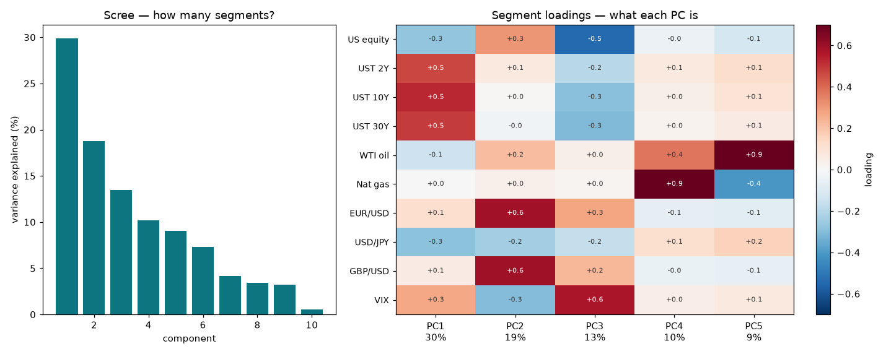
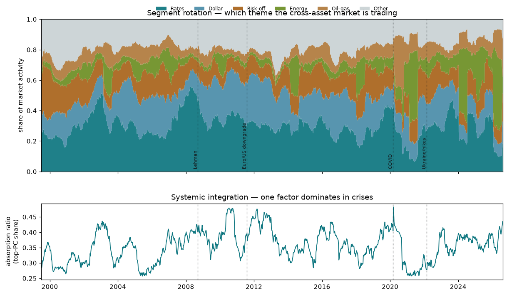
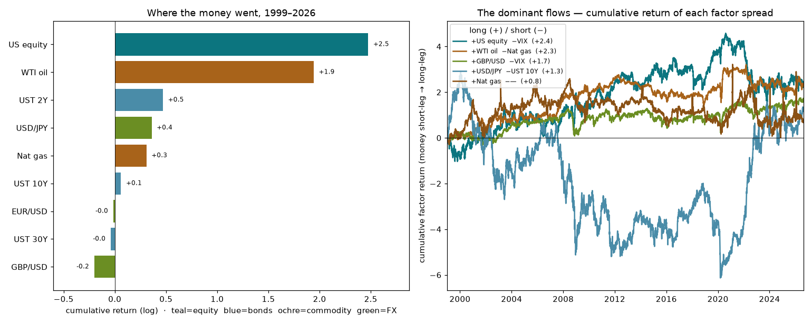
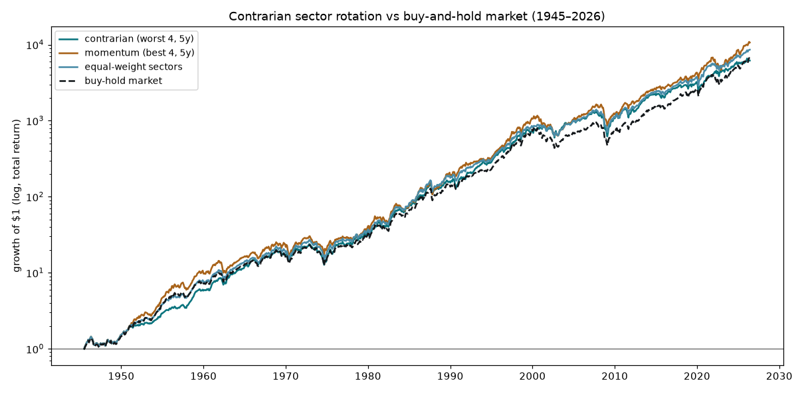
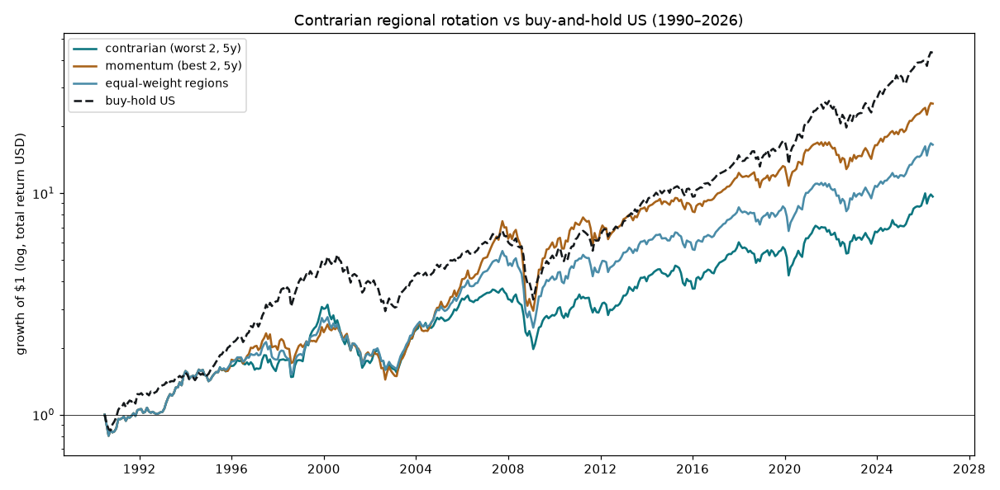

# Cross-Asset Factor Rotation — Findings

*Derive the market's "segments" by PCA of cross-asset returns, ask whether the
market rotates between them over time, and — the decisive question — whether any
of that structure is predictive or merely descriptive.*

Sibling to the UK-equity / volatility programme; same discipline (causal /
walk-forward, permutation nulls, "a good result is a bug until proven"). Reuses
the shared venv; data is free from FRED.

## TL;DR

- **The segments are real and legible.** PCA of a 10-instrument cross-asset panel
  (1999–2026) gives four interpretable factors: **rates** (the 2/10/30y Treasury
  curve, PC1 30%), **dollar** (EUR+GBP, PC2 19%), **risk-off** (VIX↔equity, PC3
  13%) and **energy** (gas+oil, PC4 10%) — 72% of all cross-asset variance.
- **The market genuinely rotates between them.** Segment activation shifts across
  eras; the clearest instance is the **energy segment ballooning in 2022–2024**
  (the Ukraine gas/oil shock). And the **absorption ratio** — how much one factor
  dominates — is a clean systemic-integration regime (calm ~0.31, crisis ~0.44).
- **But none of it forecasts anything.** The absorption ratio does not predict
  forward equity vol — **VIX dominates it (+0.71 vs −0.04)** — and on the *fair*
  test (non-equity assets, where VIX can't compete) its incremental power after
  trailing vol + VIX is **+0.001** (range [−0.09, +0.09]).
- **First-moment is the wall, as everywhere.** No factor momentum (a small energy
  *reversal* aside), and the strongest segment lead-lag is −0.08 — noise. The
  sector-sequence hypothesis (defence→infrastructure-style chains) finds nothing.
- **Descriptively true, predictively empty** — a sixth data domain confirming the
  programme's thesis: the sophisticated structure is real, and the simple measure
  (trailing vol + VIX) already held everything forecastable.
- **Where the money went** (Phase 5): over 1999–2026 the flows ran into US equity
  (+2.5 log ≈ 12×) and oil, out of sterling, while bonds and most FX round-tripped;
  the two dominant factor spreads were "own US stocks+bonds, short volatility" and
  "long oil, short natural gas".
- **A contrarian long-horizon rotation is real cross-asset — but doesn't beat
  buy-and-hold** (Phases 6–7). Asset classes mean-revert over multi-year horizons
  (trailing-2y → forward-3y rank-IC −0.32), so a buy-the-losers rotation beats
  equal-weight and momentum — yet only *matches* the equity juggernaut on Sharpe.
  Within equity *sectors* the effect nearly vanishes (reversion −0.13 at best) and
  contrarian adds nothing over equal-weighting; between *regions* it flips outright
  to **momentum** (rank-IC +0.55), where contrarian is the *worst* strategy and
  nothing beats buy-and-hold US. The unifying principle: **what is valuation-bounded
  reverts (asset classes), what reflects persistent fundamental divergence trends
  (equity sectors and regions).**

## Data

Free daily series from FRED, 1999–2026 (6,844 aligned days): US equity (Nasdaq),
the 2/10/30-year Treasury curve, WTI oil, natural gas, EUR·JPY·GBP FX, and VIX —
10 instruments across five asset classes. Each is turned into a comparable
return: log return (prices), −Δyield (bonds), Δlog (VIX). *Gold and credit
spreads were wanted but are not free on FRED (dead IDs / ICE-BofA licensed to a
3-year cap); the panel stands without them.* Correlations sanity-check cleanly
(equity↔VIX −0.67, the yield curve +0.6–0.9, EUR↔GBP +0.65 opposite JPY).

## Method & findings

**Phase 1 — derive the segments (`run_phase1_segments.py`).** Standardise the
panel and decompose by SVD. The loadings read straight off as rates / dollar /
risk-off / energy (above); first four PCs = 72% of variance. The segments the
user hypothesised exist and are economically interpretable. 

**Phase 2 — rotation & integration (`run_phase2_rotation.py`).** Fix the segment
definitions and track each one's share of rolling market activity, plus the
absorption ratio. The composition rotates visibly (energy in 2022–2024 the
standout), and integration is a legible regime — high in 2008–2011 / the 2020
spike / 2022+, lowest in the 2005 and 2021 calms. *(A subtlety: at the cross-asset
level the crisis factor is "flight to quality" — rates and risk-off firing
together — so it spreads across fixed segments and the rolling absorption ratio
captures it better than any single one.)* 

**Phase 3 — is it predictive? (`run_phase3_predict.py`).** No. The absorption
ratio's IC to forward equity vol is −0.04 while VIX's is **+0.71**; its faint
+0.10 to forward returns is borderline (z≈2) and the *wrong sign* for the
fragility story — really a weaker echo of the stress-then-recovery signal VIX
already carries. Factor momentum is ~0 (energy/oil show a small −0.09 reversal),
and the strongest next-day segment lead-lag across all pairs is −0.08.

**Phase 4 — the fair test: non-equity vol (`run_phase4_nonequity.py`).** For
equity VIX was always going to win, so we test the eight bond/FX/commodity
instruments, where there is no VIX-equivalent. Own trailing vol forecasts forward
vol best (mean IC +0.63); VIX adds cross-asset info (+0.35); the absorption ratio
raw is +0.07 — and **after removing trailing vol + VIX its partial IC is +0.001**
(range [−0.09, +0.09]). Cross-asset structure adds nothing the plainest tools miss.

**Phase 5 — where the money went (`run_phase5_flows.py`).** Performance, not
activity: cumulative returns by instrument, and each PCA factor as a long/short
spread whose cumulative return is a net flow. US equity dominates (+2.5 log ≈ 12×),
oil second (+1.9, via violent round-trips), sterling the lone loser; bonds and most
FX round-trip. The biggest persistent spreads: "own US stocks + bonds, short
volatility" (+2.4) and "long oil, short natural gas" (+2.3); the great drama is the
bond curve — a catastrophic short through the long bull, a windfall on the 2022
crash. *(Price/level trends: no dividends/carry/roll, so directional not exact; the
standardised PCA scores themselves carry no drift by construction — the flow lives
in the means, so raw returns are projected onto the loadings.)* 

**Phase 6 — a long-horizon contrarian rotation? (`run_phase6_rotation.py`).** Buy
the factor money has fled, hold for years until it flows back. It needs multi-year
mean reversion — and cross-asset that reversion is real: pooled rank-IC(trailing,
forward) is negative and strengthens with horizon (−0.32 at trailing-2y →
forward-3y; momentum at these horizons is *negative* — buying winners is wrong).
The backtest: contrarian +6.7% / Sharpe 0.23 **beats** equal-weight (+2.2/0.08) and
demolishes momentum (−1.4/−0.04), and *led* buy-hold equity for two decades (equity
was underwater 2000–2013) — but ends only *tied* (~7×), and equity edges it on
Sharpe (0.33) via lower vol; dividends would tip equity clearly ahead. Real, but it
does not beat simply holding equities.

**Phase 7 — the within-equity sector version (`run_phase7_sector.py`).** The
natural fix — stay fully in equities, rotate between out-of-favour *sectors* — on
Ken French's 12 industry portfolios (value-weighted total returns, 1945–2026).
Here the effect nearly vanishes: sector reversion tops out at −0.13, and the
concentrated contrarian book (Sharpe 0.55–0.60) ≈ momentum ≈ equal-weight (0.59),
edging equal-weight only at a cherry-pickable 10-year formation. The one robust
outperformance is **equal-weighting** (0.59 vs the cap-weighted market's 0.55) —
the diversification premium, not the contrarian signal. Asset classes revert;
sectors trend. 

**Phase 8 — the regional version (`run_phase8_regional.py`).** Regional equity
leadership runs in decade-long cycles (US ↔ rest-of-world), so regions *looked*
like the promising case — cyclical, like asset classes. The data flips it: on Ken
French regional total returns (North America, Europe, Japan, Asia Pacific,
Emerging; USD, 1990–2026) the cross-sectional IC is **positive** — momentum, not
reversion (trailing-3y → forward-3y **+0.55**). The cycles are real but far too
slow to register at 1–5-year horizons; inside them the trend dominates. So
contrarian is the **worst** book (Sharpe 0.32), momentum second (0.46), and
**nothing beats buy-and-hold US** (0.60, 43×) — US exceptionalism, 1990–2026.
*(Caveat: this sample is dominated by one great trend, post-2010 US outperformance,
which flatters buy-US and punishes contrarian; a mean-reversion of US leadership
would give regional contrarian its decade.)* 

## Conclusions

1. **The description is rich and validated** — real, interpretable segments; a
   genuine, legible rotation between them (energy 2022); real integration regimes.
2. **The prediction is empty** — the forecastable second-moment content is already
   priced by VIX and trailing vol; the PCA structure adds no incremental edge for
   equity *or* non-equity risk; and first-moment rotation/lead-lag is absent.
3. **Sixth confirmation of the thesis.** Sophisticated structure that is *true*
   but not *useful*, beaten on forecasting by a one-line measure — the same
   pattern as the adaptive filters, the pattern detector, the HAR vol forecaster,
   and the variance-premium timing. The wall is not that structure doesn't exist;
   it is that the simple thing already had everything you can trade.
4. **On rotation as a strategy (Phases 5–8): real cross-asset, but not an edge —
   and a clean taxonomy.** Long-horizon mean reversion is a genuine *cross-asset-
   class* phenomenon — contrarian rotation beats equal-weight and momentum — yet it
   only *matches* the equity market it must underweight. Within equities it
   inverts: *sectors* trend (contrarian ties equal-weight) and *regions* trend
   hard (momentum wins, contrarian is worst, buy-and-hold US beats all). The
   unifying rule is the payoff of the whole thread: **what is valuation-bounded
   reverts — commodity prices, yields, currencies — so contrarian pays across
   asset classes; what reflects persistent fundamental divergence trends — which
   companies and which countries are winning — so momentum pays within equities.**
   Contrarian long-horizon rotation is real, but only where prices are anchored to
   something that pulls them back; it is still no free lunch over buy-and-hold.

## Reproducing

```
pca/data.py                 # FRED cross-asset panel -> aligned return matrix
pca/factors.py              # standardise + SVD PCA (tested)
pca/french.py               # Ken French industry portfolios + F-F factors (tested)
run_phase1_segments.py      # derive the segments (rates/dollar/risk-off/energy)
run_phase2_rotation.py      # rotation map + absorption-ratio integration regime
run_phase3_predict.py       # predictive test: AR loses to VIX; no lead-lag
run_phase4_nonequity.py     # fair test on non-equity vol: AR partial +0.001
run_phase5_flows.py         # where the money went (instrument & factor flows)
run_phase6_rotation.py      # cross-asset contrarian rotation (real; ties equity)
run_phase7_sector.py        # within-equity sector rotation (no edge; equal-wt wins)
run_phase8_regional.py      # regional rotation (momentum, not reversion; buy-US wins)
tests/                      # pytest: standardize, PCA, block recovery, French loaders
data/*.csv, data/french/    # cached FRED series + Ken French (industry, factors, regions)
```

Shared venv at `../heirarchical-adaptive-filter-experiment`. Series pulled once
from FRED (`fredgraph.csv?id=...`).
