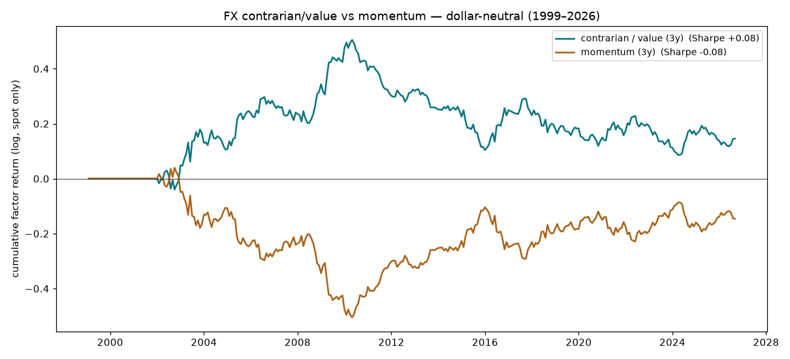
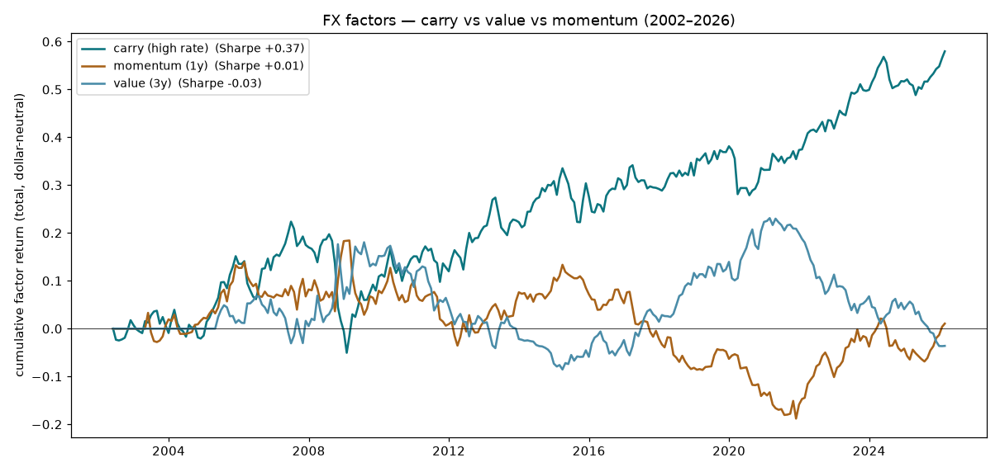
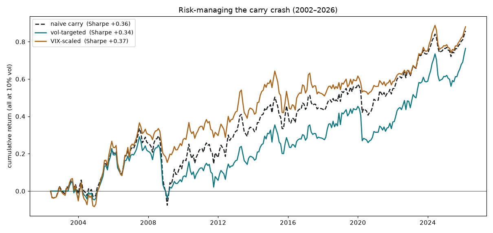

# FX Factors — Findings

*Apply the rotation/taxonomy idea to currencies. Do they revert (contrarian pays,
as the "valuation-bounded" rule predicts) or trend? And what actually pays in FX?*

Sibling to the factor-rotation and variance-premium experiments; same discipline
(causal / walk-forward, "a good result is a bug until proven"). Data free from
FRED. Currencies expressed as returns vs USD; CNY excluded (pegged).

## TL;DR

- **FX confirms the taxonomy: currencies revert at long horizons.** Because they
  are anchored to purchasing-power parity — the ultimate *valuation-bounded* asset
  — the beaten-down currency bounces back over multi-year horizons. Cross-sectional
  reversion IC is negative at 3–5-year horizons (trailing-3y → forward-5y **−0.18**);
  a value (contrarian) long/short factor pays a Sharpe of **+0.08** (3y formation),
  and momentum pays only at the 1-year horizon (+0.11). The sign-flip vs equity
  regions (which trend at every horizon) is the cleanest confirmation of the rule:
  **bounded reverts, fundamental-divergence trends.**
- **But value/momentum are weak; the real FX edge is CARRY.** Long high-interest-
  rate currencies, short low: **Sharpe +0.36** (2002–2026), steadily positive,
  dwarfing value (−0.03) and momentum (+0.01) on total returns.
- **Carry is the variance premium in FX clothing.** Both are *sell-insurance* risk
  premia — Sharpe ~0.36, a thin steady premium, and a violent crash in risk-off
  (carry's worst months are 2008-10 −9%, 2020-03 −7%; max drawdown −27%). The only
  repeatable edges the whole programme found are risk premia of this shape.
- **You cannot time the premium for free.** Risk-managing carry with VIX (cut when
  fear is high) gave a *look-ahead* Sharpe of 0.64 — until the VIX signal was
  lagged one month, whereupon it collapsed to **0.37, no better than naive**. But
  causal VIX-scaling does genuinely **reshape the tail** — same Sharpe, same
  exposure, drawdown halved (−41% → −22% at 10% vol). A de-risking overlay, not
  alpha: you choose how much crash to bear, you don't earn extra by timing it.

## Data

Free daily FRED exchange rates for 16 currencies vs USD (1999–2026 common window:
EUR, GBP, AUD, NZD, JPY, CAD, CHF, MXN, BRL, ZAR, INR, KRW, SGD, SEK, NOK, DKK; CNY
excluded — pegged). For carry, FRED 3-month interbank rates (OECD IR3TIB01) cover
12 of them + the US; Japan's rate starts 2002, setting the carry window. Total
return = spot + (foreign − US rate)/12 using the prior month's rate (causal). VIX
from FRED for the risk-management test. Missing: the big EM high-yielders (BRL/ZAR/
INR lack a clean FRED short rate), so the carry magnitude here is understated.

## Method & findings

**Phase 1 — revert or trend? (`run_phase1_fx.py`).** Cross-sectional reversion IC
is negative at long horizons and positive at 1 year — value (reversion) long-term,
momentum short-term, the classic FX pattern. A dollar-neutral value factor pays
Sharpe +0.08 (3y), momentum +0.11 (1y); both small, and value's run was mostly
2003–2010 before fading. The point is the *sign*: FX reverts where equity regions
trended — the taxonomy holds. 

**Phase 2 — the real edge is carry (`run_phase2_carry.py`).** On total returns,
long high-yielders / short low-yielders pays **Sharpe +0.36** (ann +2.5% at 6.7%
vol; ~5.4% vol-targeted to 15%), versus value −0.03 and momentum +0.01. Carry
climbs steadily but crashes hard in risk-off (worst months 2008/2020, maxDD −27%)
— a short-risk-off premium, the same species as the variance premium (both Sharpe
~0.36, both crash when everything else does). 

**Phase 3 — can risk-management tame the crash? (`run_phase3_carry_riskmgmt.py`).**
A first pass showed VIX-scaling lifting carry's Sharpe to 0.64 — but that sized
each month by its *own* ending VIX (look-ahead). Lagged one month, the Sharpe
returns to **0.37, identical to naive** — you cannot time the premium for extra
risk-adjusted return. What causal VIX-scaling *does* do is halve the tail: at
matched 10% vol and ~equal average exposure, maxDD −41% → −22% and worst month
−13.7% → −9.4%, by trimming exposure as fear builds into a crisis. Vol-targeting on
carry's own volatility does nothing (its vol doesn't lead the crash).


## Conclusions

1. **The taxonomy holds in FX.** Currencies are valuation-bounded (PPP) and revert
   at long horizons — contrarian/value pays (weakly), momentum only short-term.
   The rule now spans five domains: bounded reverts, fundamental-divergence trends.
2. **The real currency edge is carry** — a genuine, persistent Sharpe-0.36 risk
   premium, and the *same trade* as the variance premium: sell insurance, earn a
   thin steady premium, wear the crash. Across the whole programme, **every
   repeatable edge is a risk premium of exactly this shape** — never a direction
   forecast.
3. **A premium can't be timed for free.** Risk-management doesn't lift carry's
   Sharpe (the 0.64 was look-ahead); it only reshapes the tail — halving the
   drawdown at constant efficiency. You choose how much crash to bear, not whether
   to be paid extra for dodging it. Same lesson as the variance premium, twice now.

## Further work

- **Add EM high-yielders** (BRL, ZAR, TRY, IDR) with their short rates — carry's
  real magnitude lives there (bigger return, bigger crashes).
- **Carry + variance-premium as one book** — both are short-risk-off; do they
  diversify each other, or just double the same tail?

## Reproducing

```
fx/data.py                       # FRED FX returns + rates + carry total returns (tested)
run_phase1_fx.py                 # value (reverts long-horizon) vs momentum
run_phase2_carry.py              # carry is the real FX edge (Sharpe 0.36)
run_phase3_carry_riskmgmt.py     # VIX-scaling: reshapes tail, no Sharpe gain (look-ahead caught)
tests/                           # pytest: FX returns, rates, causal carry
data/*.csv                       # cached FRED exchange rates, interbank rates, VIX
```

Shared venv at `../heirarchical-adaptive-filter-experiment`. Series pulled once
from FRED.
