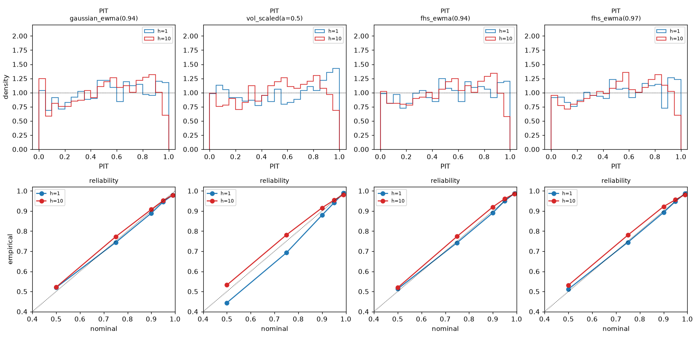
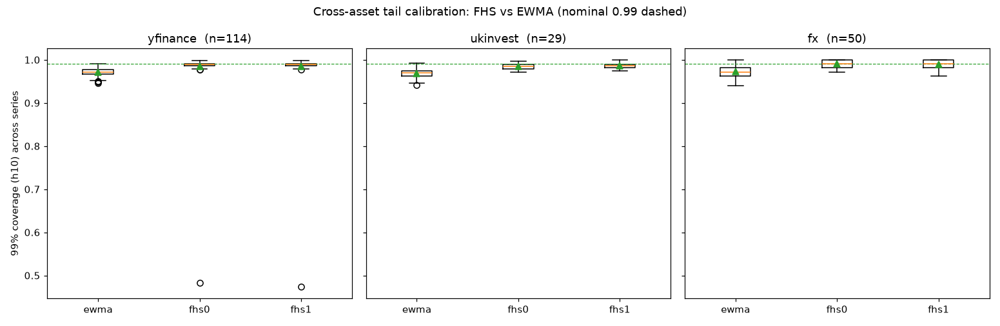

# Monte-Carlo Envelopes for Share/Index Prices — Findings

*A study of whether Monte-Carlo resampling of historical returns produces useful
forward price envelopes, and what — if anything — is worth trading.*

## TL;DR

- **We first tested calibration, not direction.** The calibration forecasters
  are centred on **zero drift**, so the question is only "is the envelope *width*
  honest?" (a volatility forecast). Under that anchor, direction is set aside by
  construction.
- **Naïve Monte-Carlo adds nothing.** Bootstrapping raw returns (IID, block,
  age-weighted, or globally vol-scaled) never beats a trivial **drift-zero
  EWMA-volatility Gaussian** baseline. At best it reaches parity.
- **Filtered Historical Simulation (FHS) is the one robust win.** Standardising
  each return by its own conditional volatility, bootstrapping the residuals, and
  propagating volatility forward reproduces volatility clustering and **tightens
  tail calibration toward nominal**.
- **It generalises.** Out-of-sample across **193 series** (114 + 29 equities,
  50 FX/metals) and three time eras, FHS beats the EWMA benchmark on 99% tail
  calibration in **98% of equities** and reaches **essentially nominal on FX**.
- **Direction is partly predictable — but not profitably (yet).** Un-pinning the
  drift and testing a **cross-timescale mean-reversion** signal (long-run drift
  vs short-run drift) finds a **genuine, statistically significant predictor**
  (cross-sectional rank IC t = 3.24 over 143 stocks; it beats classic momentum),
  and confidence-gating sharpens it as hypothesised. The effect is **robust
  across history lengths** (a whole short-window band, not a lucky pair); using
  *more than two* lengths only denoises, and a non-linear (NN-style) combination
  overfits rather than helps. **But** across every naive portfolio construction
  the ~0.03–0.10 IC does **not** survive turnover, costs and crash drawdowns. See
  [§7](#7-is-there-a-trading-strategy) and [§7.5](#75-directional-addendum).
- **Trading:** the demonstrated value is in **risk** — volatility-targeted
  sizing and honest VaR/limits. Directional alpha exists as a *signal* but not a
  *tradeable strategy* in the forms tested; volatility relative-value (options)
  remains the untested place for structural alpha.

---

## 1. Objective and anchoring decisions

The brief (see `README.md`): for each day, take the recent return history, Monte-
Carlo simulate forward by resampling those returns, and build confidence
envelopes for the future price; then judge the envelopes against what actually
happened.

Before writing code we fixed four anchors that shaped everything:

| Decision | Rationale |
|---|---|
| **Anchor on calibration, drift pinned to zero** | The mean/direction of returns is ~unpredictable; the *width* (volatility) is the forecastable part. Judge honesty of the width, not a direction we don't believe in. |
| **Log returns throughout** | Additive across time; clean compounding. |
| **Strict walk-forward evaluation** | No look-ahead; every forecast uses only past data. Reserve out-of-sample. |
| **No neural network** | ~Thousands of noisy, autocorrelated points; an opaque non-linear combiner would overfit invisibly. Stay transparent and statistically grounded. |

## 2. Data

- **FTSE 100 index**, `~/Projects/FTSEData/all.csv`, daily 1990–2021 (8,157 log
  returns). Primary development series.
- **UK equities**: `~/Projects/shares/data/yfinance` (~120) and `ukinvesting`
  (~29), daily, investing.com format, mostly 2000–2026.
- **FX & metals**: `~/Projects/shares/data/fxdata`, **intraday minute bars**
  2010–2017, aggregated here to **daily EOD closes** for ~50 pairs/metals.

The loader (`mc/data.py`) auto-detects the two on-disk formats (Close vs Price
column; MM/DD/YYYY vs DD/MM/YYYY; commas, BOM, non-numeric cells). Everything
downstream sees only an ascending price array, so onboarding a new source only
ever touches the loader.

## 3. Method and evaluation harness

**Universal forecaster interface.** A *forecaster* maps
`(return history up to origin t, horizon T, quantile levels)` → **predictive
quantiles of the drift-zero cumulative log-return** for horizons `1…T`. Analytic
baselines and simulation forecasters therefore score on identical footing.

**Scoring (all on quantiles, `mc/scoring.py`):**

- **Interval coverage** — does the realised path fall inside the nominal central
  band? Aggregated over many origins → empirical vs nominal (the calibration
  anchor).
- **PIT** (probability integral transform) — where the outcome sits in the
  predictive CDF; ~Uniform(0,1) iff well calibrated. Edge spikes at 0/1 = fat
  tails under-covered.
- **CRPS**, obtained from the quantile representation as
  `2·mean(pinball over a dense τ-grid)` — a proper score on the whole
  distribution, needing no Monte-Carlo ensemble.

**Walk-forward** (`mc/walkforward.py`): for each origin, build quantiles from
`r[:t+1]` only, score against `r[t+1 : t+1+T]`. Horizon `T=10` trading days.
Consecutive windows overlap, so per-origin scores are dependent — point
estimates are unbiased, but we treat significance qualitatively and thin origins
with a stride.

The numerical kernels are unit-tested (30 tests; CRPS is checked against its
closed form for a Normal).

## 4. What we tried, and what happened (FTSE, in-sample)

| Phase | Forecaster | Result vs EWMA benchmark |
|---|---|---|
| 0 | **Baselines**: Gaussian-EWMA(λ=0.94); empirical √T-scaled | EWMA already **near-perfect 50–95%** at all horizons. Universal gap: **99% tail under-covers** (~0.97). Sets a high bar. |
| 1 | **IID bootstrap** of returns | Does **not** beat EWMA. Same tail gap; *regime-blind body over-coverage* at multi-day horizons (long static window ignores current vol). |
| 2 | **Age-weighted** (recency) + **stationary block** bootstrap | Age-weighting **fixes the body over-coverage and ties EWMA on CRPS** — first parity. Block bootstrap does **not** close the tail (FTSE's fat tails come from vol-clustering, not linear autocorrelation). |
| 3 | **Backward simulation** as a per-origin *trust* signal | The signal is **real** (tail breaches concentrate at high-distrust origins) **but dominated by a one-line control**, `recent vol ÷ window vol` (Spearman 0.41 vs 0.26). Key insight: the tail gap is **concentrated at regime transitions**, not uniform. |
| 4 | **Vol-scaled** long-window bootstrap; **multi-N average** | `vol_scaled(α=0.5)` reaches **parity+**: first CRPS edge and first tail gain at h=1 (99%→0.989), but a body-peakedness blemish. Multi-N averaging over-covers. |
| 5 | **Filtered Historical Simulation** (EWMA vol filter) | **The winner.** Improves the multi-day 99% tail (0.985 vs 0.980) **while keeping the body**; CRPS ties EWMA. PIT edge-spikes visibly shrink. |
| 5b | **GJR leverage** term (γ) in the FHS filter | **Marginal**: ~0.2% CRPS, no calibration change. A small, non-harmful refinement. |

**Reading of the arc:** the fat tail is a *volatility-clustering* phenomenon, and
only a method that models volatility **per observation** (FHS) — not resampling
raw returns — captures it. This vindicates the opening steer: the width is the
signal, and it must be conditioned on the current volatility state.



## 5. Out-of-sample validation

Nothing is *fitted* to outcomes (λ, γ, α are fixed rules), so a new series or era
is a true generalisation test.

**Temporal (FTSE, 3 eras).** FHS ≥ EWMA on 99% and 90% coverage in **every** era
— at nominal in 1994–2013, clearly better in the harder 2014–2021 (where *both*
under-cover, as sudden shocks outrun a fixed-λ filter). Not a 2008 artefact.

**Cross-asset (193 series).**

| source | n | mean cov99: ewma → fhs | FHS tail-wins | median CRPS ratio |
|---|---|---|---|---|
| yfinance equities | 114 | 0.971 → 0.984 | **98%** | 0.999 |
| ukinvesting equities | 29 | 0.968 → 0.985 | 93% | 0.999 |
| FX / metals | 50 | 0.973 → **0.991** | 56% | 1.000 |
| **all** | **193** | **0.971 → 0.986** | **87%** | 0.999 |

*(nominal 99% coverage = 0.990)*



- **Equities: FHS dominates** — beats EWMA's tail calibration in ~98% of stocks,
  at no CRPS cost.
- **FX: the honest nuance** — FHS's *average* tail calibration is the best of any
  asset class (0.991, bang on nominal, because FX daily tails are less violent
  and more conditionally-Gaussian), **but** the per-series win-rate is only 56%
  (a coin-flip) because EWMA is already good on FX and FHS sometimes overshoots.
  **FHS's per-series superiority is primarily an equity phenomenon.**
- **Residual gap**: the most jump-prone single stocks still under-cover the 99%
  tail — FHS *narrows* but does not *close* it. (Two ~0.47 outliers are
  corporate-action jumps that slipped the `|r|>0.6` glitch filter.)

## 6. Conclusions

1. **Direction is not predictable here** — by design and by result.
2. **Naïve Monte-Carlo of raw returns is not worth the compute** — a drift-zero
   EWMA-vol Gaussian equals or beats it.
3. **FHS is the one robust improvement** — per-observation volatility
   standardisation with forward clustering — and it **generalises across assets
   and time**, decisively on equities, on-average on FX.
4. **A GJR leverage term helps marginally**; the backward-simulation trust idea
   is real but dominated by a trivial recent-vol ratio.
5. The deliverable is a **calibrated-volatility instrument**, not a price
   predictor.
6. **A fancier vol filter improves calibration — but only if estimated robustly.**
   FHS used a single EWMA(0.94) vol filter. We integrated `haf`'s stack of vol
   experts as `mc.forecasters.fhs_stack` (conditional variance = fitted combination
   of expert variances, standardised and propagated forward through FHS). Across
   the full **193-series OOS**, *how the coefficients are fit is decisive*:
   - **Per-series** fitting (~1,000 obs each; `run_fhs_stack_full.py`) produced wild
     *signed* coefficients that **overfit the train regime and under-cover** OOS
     (mean 90 % coverage 0.73 vs EWMA's 0.89) — beating EWMA on only ~24 % of series.
   - **Pooled** fitting — one robust, all-positive coefficient set across all series
     (`run_fhs_stack_pooled.py`) — **generalises and beats fhs_ewma**: coverage
     closer to nominal at 90/95/99 %, the 99 % tail closing 0.983 → 0.989, and
     **lower CRPS on 94 % of the 193 series**.

   So the stack genuinely upgrades the FHS filter, *provided* it is estimated
   robustly (pooled), not fit per-instrument. The meta-lesson recurs: it is **robust
   vs overfit**, not complex vs simple — per-instrument adaptation of the richer
   model overfits (and haf's optimal *signed* coefficients are exactly what
   overfits per-series); robust pooled estimation of the same model wins. This fits
   the **SNR/complexity gradient** across all three projects — sophistication pays
   for volatility (high SNR) when estimated robustly, but fails for direction
   regardless (haf's signed combiner *hurts* our low-SNR directional signals,
   `../pattern-discovery/run_phase11_signed.py`).

## 7. Is there a trading strategy?

**A calibrated envelope is not itself a signal.** Centred on zero drift, it tells
you *how wide*, never *which way*. Direction was investigated separately — a real
signal was found but it is not (yet) tradeable; see [§7.5](#75-directional-addendum).
Where calibrated volatility pays, ranked by how well the evidence supports it:

1. **Volatility-targeted position sizing (well-supported).** Scaling exposure
   inversely to the forecast volatility is a documented way to improve
   *risk-adjusted* return (Sharpe) with **zero directional edge**, by stabilising
   risk and cutting drawdowns. Our FHS volatility forecast is a good input.
   *This is a risk-shaping play, not return prediction.*
2. **VaR / risk limits / capital (directly demonstrated).** FHS *is* the standard
   filtered-historical-simulation VaR method. Our honest 99% tail coverage where
   the EWMA-Gaussian under-covers means **fewer surprise limit breaches** — real
   money in avoided tail blow-ups. The strongest *demonstrated* use.
3. **Volatility relative value / options (plausible, UNTESTED).** The one place
   genuine alpha might live: compare our calibrated forecast distribution to the
   distribution *implied* by option prices and trade the gap (e.g. sell vol when
   implied > forecast; the tail-specific version for puts). **We have not tested
   this** — no options data — and it is confounded by the **variance risk
   premium** (implied structurally exceeds realised). It is the best *next*
   research question, not a proven edge.
4. **Regime/breach overlay (risk control, not alpha).** Phase 3 showed envelope
   breaches cluster at regime transitions; a breach can gate de-risking of other
   strategies.

**What each would need to become real:**

- *Vol-targeting*: a backtest of `size ∝ 1/σ̂` vs buy-and-hold on a Sharpe /
  max-drawdown basis, with turnover and transaction costs.
- *VaR*: formal backtests (Kupiec unconditional, Christoffersen independence) and
  a capital/limit framework.
- *Options RV*: implied-vol / option-price data, a forecast-vs-implied signal, and
  a costed backtest that respects the variance risk premium and gamma/theta P&L.

**Caveats for any of these.** Transaction costs and capacity; the residual
single-stock tail gap (worst exactly where risk matters); FX where a simpler EWMA
already suffices; and in-sample tuning risk (mitigated, not eliminated, by the
193-series out-of-sample evidence).

### 7.5 Directional addendum: does the multi-history idea predict direction?

Motivated by a specific hypothesis: use a **long** history to set the "fair"
long-run drift, a **short** history to detect a deviation, and treat a
*significant* divergence as a **mean-reversion** signal (recent drift below the
long-run mean → expect catch-up), with confidence from the envelopes and
reliability from the backward simulation. Signal `s = long_drift − short_drift`;
confidence `= |divergence| / SE`.

**Test A — single series (FTSE), stratified by confidence** (`run_direction.py`).
Across an 8-point grid of `(Ns, Nl, H)`, the information coefficient is **positive
everywhere** (+0.07 to +0.10) — the effect is **mean-reversion**, not momentum, at
10–20-day horizons. Crucially, predictability **concentrates in the
highest-confidence divergences**: the top-confidence quintile IC reaches **+0.28
to +0.34** (with a 60-day short window; a 20-day short is just reversal noise). The
gate works — though the relationship is a *tail* effect, not a smooth gradient,
and hit-rate is only ~51–53%.

**Test B — cross-sectional across 143 equities** (`run_xsec_direction.py`). The
reversion signal has a **statistically significant** mean cross-sectional rank IC
of **+0.031 (t = 3.24)**, and **beats classic momentum** (+0.014, t = 1.25,
insignificant). This corroborates Test A on 143 independent series. **But** the
naive long-short quintile portfolio is weak: **gross Sharpe ≈ 0.28**, a ~60%
drawdown (reversion is structurally short crash-protection — it bleeds through
2008), and this is *before* costs.

**Test B2 — confidence-gated, inverse-vol sized** (`run_xsec_gated.py`). Using the
signed z-score as a vol-normalised, confidence-weighted signal, gating to
`|z| ≥ 1` **lifts the rank IC to +0.045** (as Test A predicts) — *but the portfolio
gets worse*: gross Sharpe collapses to **0.03** and goes **negative after 10 bps
costs**, because gating sacrifices breadth, the z/vol weighting churns (turnover
1.4/period), and concentrated bets blow up together (2008 **and** 2020).

**Test C — beyond fixed pairs: the history-length spectrum** (`run_termstructure.py`).
A finer sweep of the `(Ns, Nl)` plane shows the reversion signal is **robust and
interpretable**, not an artefact of a few pairs: a uniformly positive band for
short windows ≤ ~90 days against *any* long anchor (IC +0.07 to +0.15), fading to
~0 and flipping negative once the "short" window is itself 6–12 months (momentum
territory). Using **more than two** history lengths — the drift *term structure*
(slope of drift vs log-lookback; a robust multi-window anchor with cross-timescale
agreement) — gives IC ≈ 0.10, **comparable to a typical pair but not better than
the best one**. This is expected: drift at different lookbacks is the *same series
smoothed at different scales*, so extra windows **denoise** rather than add
independent signal. Their merit is parsimony and robustness (no window
cherry-picking), not extra predictive power.

**Test D — non-linear combination (the shelved neural network)**
(`run_nonlinear_probe.py`). Tested the cheapest rung of non-linearity: pooled 36k
stock-date observations, a temporal train/test split, and an OLS with interaction
and squared terms. Out-of-sample it **underperformed the single linear signal**
(rank IC +0.003 vs +0.011) — the overfitting signature, at the mildest possible
rung. The only genuine non-linear structure is a mild, monotone reversion×vol
interaction (IC +0.041 low-vol vs +0.025 high-vol), captured by a simple filter,
not needing a network. With ~1% signal-to-noise and collinear price-derived
inputs, added flexibility fits noise: a NN is very unlikely to help, and was not
pursued further. (NNs earn their keep with *many distinct* features and richer
data — none of which this problem has.)

**Conclusion.** There **is** a genuine, statistically significant directional
predictor — a cross-timescale mean-reversion effect, robust across history
lengths, and the confidence-gating intuition is correct *at the signal level*.
This revises the naive "no direction" reading. **However, a real signal is not a
profitable strategy:** a ~0.03–0.10 IC does not survive turnover, transaction
costs and crash drawdowns in any construction tested; more history lengths denoise
but do not add signal; and non-linear combination overfits rather than helps. The
honest status: **promising signal, unproven strategy.**

## 8. Reproducing

```
mc/                     # tested library (data, returns, scoring, forecasters, walk-forward, backward)
run_phase0..5b.py       # in-sample phases on FTSE
run_oos.py              # temporal out-of-sample (FTSE eras)
run_xsec_all.py         # full cross-asset OOS (resumable, checkpoints to xsec_results.csv)
run_fhs_stack_oos.py    # FHS with haf expert-stack vol filter vs EWMA (FTSE + 40-stock)
run_fhs_stack_full.py   # full 193-series OOS, PER-SERIES coeffs: overfits, under-covers
run_fhs_stack_pooled.py # full 193-series OOS, POOLED coeffs: beats EWMA (CRPS 94%)
summarise_fhs_stack.py  # summary of a stack-vs-ewma results CSV (pass path as arg)
summarise_xsec.py       # summary tables + figure from the results CSV
run_direction.py        # directional Test A: stratified IC on FTSE (§7.5)
run_xsec_direction.py   # directional Test B: cross-sectional reversion vs momentum
run_xsec_gated.py       # directional Test B2: confidence-gated, vol-normalised
run_termstructure.py    # directional Test C: (Ns,Nl) sweep + drift term structure
run_nonlinear_probe.py  # directional Test D: is non-linearity (a NN) worth it?
tests/                  # pytest suite for the numerical kernels
```

Run with the Python venv at
`~/Projects/share-jupyter-experiments/heirarchical-adaptive-filter-experiment`
(numpy, pandas, matplotlib, pytest). Example:
`PY=~/Projects/.../bin/python; $PY -m pytest -q; $PY run_phase5.py`.
