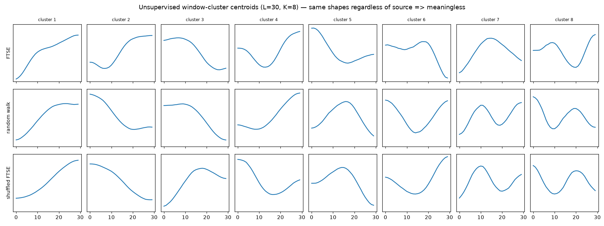
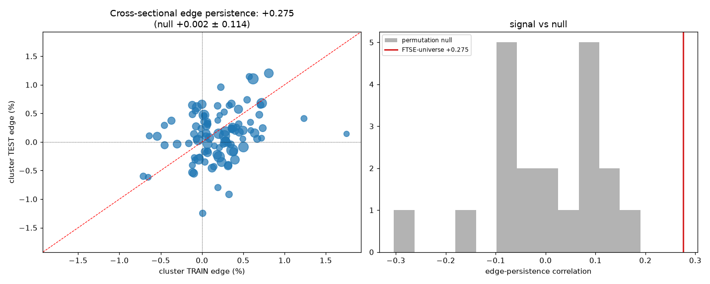
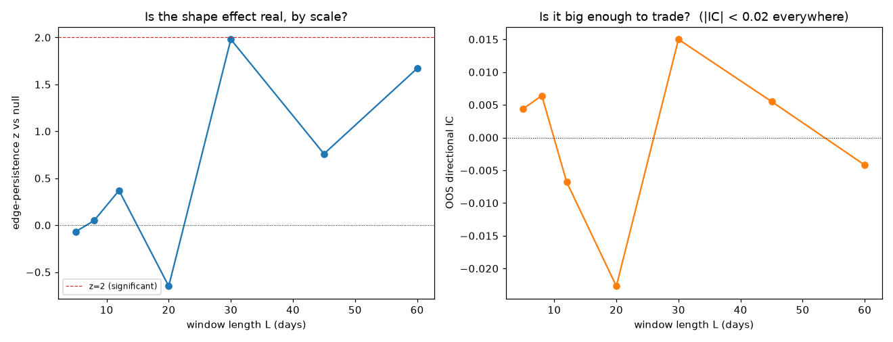
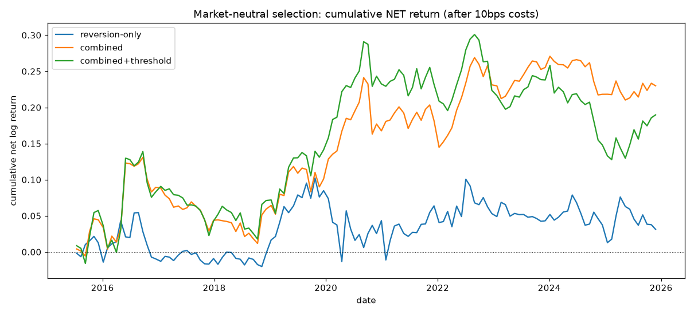
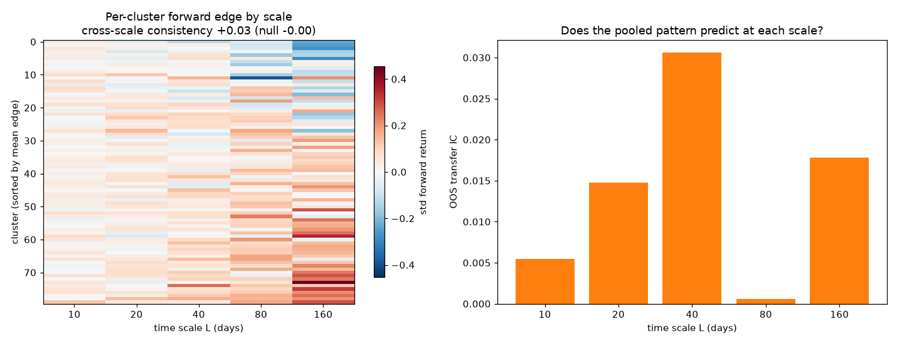
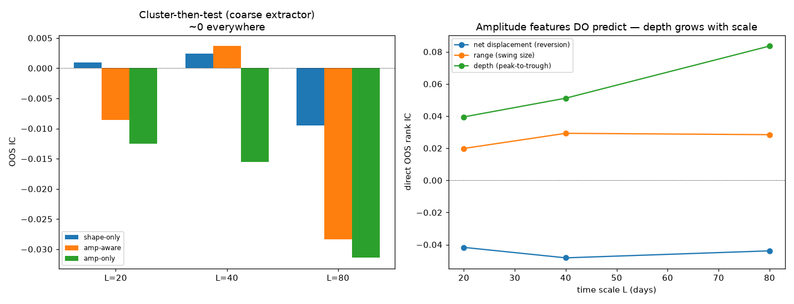
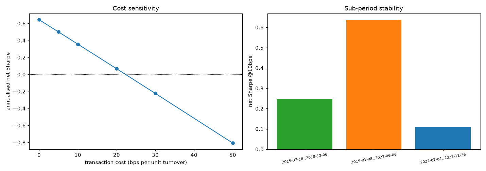

# Data-Driven Price-Pattern Discovery — Findings

*Can we discover predictive price-shape patterns directly from data (rather than
hand-crafting triangles, head-and-shoulders, etc.), and can disciplined portfolio
construction make them tradeable?*

Companion to the Monte-Carlo study (`../monte-carlo-experiment/WRITEUP.md`); it
reuses that project's `mc` package (loader, returns, scoring). Read together, the
two form one arc: **real signals exist, and here is exactly how far honest
methodology can push them.**

## TL;DR

- **Unsupervised pattern discovery is meaningless here** (as Keogh & Lin 2005
  warned). Clustering sliding-window price shapes gives the *same* sinusoidal
  centroids whether the input is FTSE, a random walk, or shuffled noise
  (cross-source centroid similarity ~0.86–0.90). The "patterns" are artefacts of
  the sliding window, not the market. → we must go supervised.
- **Supervised shape patterns carry a real but negligible signal.** Pooling
  172k windows across 143 stocks, shape-cluster forward-return edges *persist*
  out-of-sample (train→test correlation +0.275 vs permutation null 0.00 ± 0.11,
  **z = 2.4**) — but the per-window directional **IC is 0.006, hit-rate 50%.**
  Statistically real, economically nothing.
- **Local "shapelets" are pure noise.** A length sweep shows short shapes
  (5–12 days) have zero persistence; only the ~30–60-day scale shows a whisper,
  IC never above 0.015.
- **The self-similarity premise fails.** Testing multiple scales *together*
  (scale-normalised, pooled), predictive shapes do **not** transfer across scales
  (cross-scale consistency z = 1.14, ~ chance) and multi-scale confluence does not
  sharpen the signal. Visual fractality ≠ predictive fractality.
- **Amplitude, not shape, is where the signal is.** z-normalising windows threw
  away magnitude. Kept (vs trailing-vol × √L), **peak-to-trough depth predicts,
  and more strongly at longer scales** (OOS IC 0.04 → 0.08) — the best single
  directional signal in either project. The predictive content is *how deep the
  move was*, not the geometric form; and it needs a direct feature, not
  clustering, to see it.
- **The tradeable result comes from *framing*, not patterns.** Combining
  reversion + momentum (+ the weak shape signal) and trading them as a
  **market-neutral cross-sectional selection** with inverse-volatility sizing
  produces the first positive-net-of-costs result of either project:
  **net Sharpe +0.36, market-beta ≈ 0, shallow drawdown** — but modest, and the
  alpha is mostly *classic* momentum/reversion, not the discovered patterns. And
  fragile: it **breaks even at ~22 bps** of cost and is weakest in the most recent
  years (sub-period Sharpes 0.25 / 0.64 / 0.11).

## 1. Premise and the trap

Technical analysis claims recurring price shapes precede moves. Instead of
hand-picking patterns, we sweep a moving window over many series and ask which
*shapes* predict the forward return. This maps onto real methods — **motif
discovery, subsequence clustering, shapelets** (Ye & Keogh 2009); Lo, Mamaysky &
Wang (2000) found modest real information in classical TA patterns.

The trap, known in advance: **Keogh & Lin (2005), "Clustering of Time Series
Subsequences is Meaningless."** Sliding-window subsequence cluster centres are
roughly data-independent (they approach sinusoids), because the sweep is itself a
smoothing operator. So the *unsupervised* version is a dead end, and the
*supervised* framing — select shapes by their forward-return edge — is
load-bearing.

## 2. Method

- **Windows** (`patterns/windows.py`, tested): length-L segments of the log-price
  path, **z-normalised** so only the *shape* remains (level and scale removed).
- **Label**: each window's strictly-future return over the next H steps.
- **Discipline**: strict temporal train/test split; walk-forward; permutation
  nulls; the `mc` scoring/IC machinery; baselines from the MC project (reversion,
  momentum). L=30, H=10–20, K clusters via k-means.

## 3. Findings

**Phase 1 — the meaningfulness gate (`run_phase1_meaningfulness.py`).**
Clustering z-normed windows gives near-identical sinusoidal centroids regardless
of source: FTSE-vs-random-walk centroid similarity **0.86**, FTSE-vs-shuffled
**0.90**; sinusoidality R² ~0.85–0.88. Confirmed on our own data → unsupervised
discovery is meaningless → pivot to supervised.



**Phase 2 — supervised cluster-then-test, single series (`run_phase2_supervised.py`).**
On FTSE alone, cluster train-period forward-return edges do **not** persist OOS
(train→test +0.057; IC +0.016; hit 52.9%). But this is the low-power case — one
series, coarse clusters.

**Phase 3 — cross-sectional, high power (`run_phase3_xsec.py`).** 172,411 windows,
143 stocks. Cluster edges **do** persist: train→test **+0.275** vs permutation
null 0.002 ± 0.114 → **z = 2.4**. Yet the per-window OOS directional **IC = 0.006,
hit-rate exactly 50%.** The resolution: cluster *means* (averaging thousands of
windows) expose a tiny true bias that is stably ordered, but per-window
*prediction* is worthless. **Real, and negligible** — the cautious "some truth in
TA" of Lo-Mamaysky-Wang, quantified.



**Phase 4 — shapelet / length sweep (`run_phase4_lengthsweep.py`).** Short local
shapes (5–12 days) show zero persistence and no IC; only the ~30–60-day scale
shows weak-real persistence (L=30: z = 1.98), and |IC| < 0.02 everywhere. There
is no local sub-pattern to harvest; the shape signal is long-scale and
reversion-adjacent.



**Phase 5 — market-neutral selection backtest (`run_phase5_selection.py`).** Not
"buy on a raw signal", but: each rebalance rank all instruments by a combined
score, long the best / short the worst, market-neutral, inverse-vol sized (the
FHS risk layer from the MC project), with costs.

- *Signals are partially independent* — reversion and momentum anti-correlate at
  **−0.37**; shape is near-orthogonal to both. So combining amplifies: combined
  OOS IC **0.0216** > momentum 0.0186 > reversion 0.0094 > shape 0.0038.
- *Backtest (top/bottom 20%, 10 bps costs, 2015–2026 OOS):*

  | strategy | Sharpe gross | Sharpe net | maxDD | mkt-beta |
  |---|---|---|---|---|
  | reversion-only | +0.27 | +0.05 | −0.12 | +0.10 |
  | **combined** | +0.64 | **+0.36** | −0.12 | −0.09 |
  | combined + threshold | +0.53 | +0.25 | −0.17 | −0.13 |

The combined book is genuinely market-neutral (β ≈ 0) and **positive after costs**
— the first such result in either project.



**Adding the amplitude/depth signal (`run_phase8_depth.py`).** The Phase-7 depth
signal (trailing peak-to-trough range at L=80) is **nearly independent** of the
other signals (|corr| ≤ 0.09 with reversion/momentum/shape — whereas a
drawdown-from-peak variant is 0.78 correlated with reversion, i.e. redundant). Its
standalone cross-sectional IC (0.015) is second only to momentum, and adding it
**raises the combined IC 20 % (0.0216 → 0.0259)**, **nearly halves the max
drawdown (−0.12 → −0.07)**, and **cuts turnover** (it is slow-moving). Net Sharpe
is unchanged at 0.36 — depth reduces *risk* more than it adds *return* — but it is
independent, drawdown-reducing, low-turnover information the pure-shape framework
discarded.

**Phase 6 — is the TA self-similarity premise true? (`run_phase6_multiscale.py`).**
Technical analysis holds that the *same* patterns work across time scales
(self-similarity / confluence). We tested it directly: resample windows from five
scales (10–160 days) to a common length, pool, cluster once, and check whether a
cluster's forward edge agrees across scales. It does **not**: cross-scale edge
consistency is **+0.032 vs a permutation null of 0.00 ± 0.03 (z = 1.14, not
significant)**; the pooled edge transfers erratically (OOS IC 0.031 at L=40 but
0.001 at L=80); and restricting to scale-consistent clusters *halves* the IC
(0.005 vs 0.010). **Predictive shape content is scale-specific, and multi-scale
confluence does not help.** (Markets are visually self-similar across scales, but
their *predictive* content is not — appearance ≠ forecasting power.)



**Phase 7 — amplitude matters more than shape (`run_phase7_amplitude.py`).** Every
prior phase z-normalised each window, discarding *how big* the pattern is. Keeping
amplitude — measured against trailing-volatility × √L, so scale is accounted for
rather than divided out — changes the picture. Via clustering, still ~nothing. But
the amplitude features predict *directly*: **peak-to-trough depth** (the "bottom
relative to top" ratio) has a positive OOS rank-IC that **grows with time scale:
+0.039 (L=20) → +0.051 (L=40) → +0.084 (L=80)** — the strongest single directional
signal in either project, and its growth with scale confirms that longer patterns
carry larger, more meaningful ranges. (Net displacement −0.045 is the known
reversion; range +0.025 mild.) Two lessons: the predictive content is **amplitude,
not geometric shape**; and **clustering is the wrong extractor** for a monotone
"deeper drawdown → bigger rebound" signal — it only appears when used directly.
The earlier "shapes are negligible" result was thus partly an artefact of
z-normalising amplitude away *and* forcing everything through clustering.



**Does depth help calibration? (`run_phase9_calib_depth.py`).** Direction aside, does
depth improve the *volatility/envelope-width* forecast? It carries **real
incremental information about forward realised volatility** — partial IC +0.124
over EWMA vol (ΔR² +0.011, 341k OOS equity observations) — so it is
calibration-*relevant*. But a mean-preserving depth tilt to the vol forecast leaves
in-domain pooled coverage **unchanged to three decimals**: the increment (~1 % R²,
~±6 % width) is too small to move calibration, which the EWMA level already
dominates. So depth's value is on the *direction* side (independent, drawdown-
reducing), not calibration — where EWMA/FHS already capture the usable signal.
(Note: "trailing vol" throughout means the 60-day return std of the window
*preceding* the pattern — an external causal reference, never the pattern's own
volatility.)

## 4. Is there a trading strategy?

A qualified yes — but read the attribution carefully.

- **What works:** the *framing*. Combining partially-independent signals raises
  IC (Fundamental Law: IR ≈ IC·√breadth), and trading them as a **market-neutral
  cross-sectional selection with inverse-vol sizing** converts a ~0.02 IC into a
  positive-net, low-drawdown, beta-neutral portfolio. This is the right way to
  use tiny signals, and it beats every naive long-short we tried.
- **What does *not* work:** the novel bit. The **discovered shape patterns add
  almost nothing** (IC 0.004); the edge is carried by *classic* cross-sectional
  momentum and reversion, plus good portfolio construction.
- **How good is it, really? Modest and fragile** (`run_phase5_robustness.py`).
  Sharpe 0.36 net is a research portfolio, not a business (you'd want > 1). The
  robustness pass is sobering:
  - **Cost break-even ≈ 22 bps.** Net Sharpe falls linearly: +0.50 (5 bps),
    +0.36 (10), +0.07 (20), −0.22 (30). All-in single-stock UK costs (spread +
    commission + short borrow) can easily reach that band, so it needs *cheap*
    execution (liquid large-caps) to survive.
  - **Positive in all three sub-periods but variable and decaying:** net Sharpe
    0.25 (2015–18), 0.64 (2019–22, boosted by COVID-era dispersion), **0.11
    (2022–25)** — weakest most recently.
  - Turnover (1.4) is high; the no-trade threshold did not help as implemented.



## 5. Conclusions

1. **Unsupervised chart-pattern discovery is meaningless** on this data (Keogh
   reproduced) — a useful, concrete negative.
2. **Supervised price-shape patterns are statistically real but economically
   negligible** (z = 2.4 persistence, IC 0.006) — TA has a grain of truth, and it
   is a grain.
2b. **The self-similarity premise fails for prediction** — patterns are not
   scale-invariant (z = 1.14) and multi-scale confluence does not sharpen them.
3. **The usable edge is classic factors + disciplined construction**, not novel
   patterns; combination and market-neutral selection lift it from untradeable to
   marginally positive net.
4. Across both projects the wall is the same: a **~1 % signal-to-noise ceiling**.
   Calibration (FHS) is where real value sits; direction is faint but, with the
   right framing, not quite zero.

## 5b. Cross-project synthesis: an SNR gradient (with the `haf` volatility project)

Three independently-built experiments — this one (direction via patterns),
`monte-carlo-experiment` (calibration via FHS), and `heirarchical-adaptive-filter-
experiment` (`haf`, volatility via adaptive/mixture filters) — converge on one
principle, confirmed by two fusion tests:

> **Sophistication pays where signal-to-noise is high, and hurts where it is low.**

- **Volatility is high-SNR** (Corr ~0.66). haf's fixed *signed* stack of diverse
  vol experts beats any single EWMA and any adaptive scheme. Fusing it into our
  calibration test (`run_phase10_haf_vol.py`), the stack forecasts forward vol 5×
  better than the EWMA FHS used (R² 0.28 vs 0.05) and **improves envelope
  coverage** — 90 % lands on nominal, the 99 % tail closes 0.967 → 0.976. A
  concrete cross-project improvement: FHS's single EWMA filter was suboptimal.
- **Direction is low-SNR** (~1 % IC). Borrowing haf's signed combiner for our
  directional signals (`run_phase11_signed.py`) *underperforms* equal-weight
  (IC 0.020 vs 0.026, net Sharpe 0.17 vs 0.36) — fitted weights are estimation
  noise. This is the same wall haf's adaptive schemes hit and our NN hit
  (§7.5 Test D): complexity fails where SNR is low, robust 1/N wins.

So value lives in volatility (forecastable, rewards sophistication) not direction
(near-unpredictable, where simple beats complex).

## 6. Limitations & further work

- **Robustness (done):** cost break-even ≈ 22 bps and net Sharpe positive but
  variable across sub-periods (0.25 / 0.64 / 0.11), weakest most recently — a
  marginal, cost-fragile, possibly-decaying edge, not a robust standalone one.
- **Turnover reduction (tested — does not help, `run_phase5_turnover.py`):**
  signal smoothing *destroys* the signal (gross Sharpe 0.64 → 0.11 — the alpha is
  short-lived, living in the fresh signal), and partial-rebalancing / rank-buffer
  hysteresis cut turnover only with a matching loss of gross, leaving net Sharpe
  ≤ baseline and break-even stuck at ~22–23 bps. The turnover is **intrinsic**, so
  cheap execution is a requirement, not an engineerable-away detail.
- **Realistic costs** — borrow/short constraints, market impact, spreads for
  single-name UK equities — would stress the result further.
- **Richer signals** — the shape signal is weak; the value, if any, is in
  *combining diverse* signals, so adding genuinely orthogonal ones matters more
  than refining the patterns.

## 7. Reproducing

```
patterns/                     # tested window-extraction package
run_phase1_meaningfulness.py  # Keogh gate: is unsupervised clustering meaningful?
run_phase2_supervised.py      # single-series cluster-then-test
run_phase3_xsec.py            # cross-sectional cluster-then-test (the decisive test)
run_phase4_lengthsweep.py     # shapelet / single-scale length sweep
run_phase5_selection.py       # market-neutral selection backtest (combination + FHS sizing)
run_phase5_robustness.py      # cost-sensitivity + sub-period stability
run_phase5_turnover.py        # turnover-reduction variants (does not help)
run_phase6_multiscale.py      # scale-invariance / confluence test (TA self-similarity)
run_phase7_amplitude.py       # amplitude-aware patterns: depth predicts, grows with scale
run_phase8_depth.py           # add depth to the selection book (independent, cuts drawdown)
run_phase9_calib_depth.py     # does depth help calibration? (info real, effect negligible)
tests/                        # pytest for window extraction/labelling
```

Uses the shared venv at `../heirarchical-adaptive-filter-experiment` (numpy,
pandas, matplotlib, scikit-learn, pytest). The `mc` package is imported from the
sibling `monte-carlo-experiment` via a `.pth` entry in the venv's site-packages.
