# Pattern Matching in Price History — Findings

*Can a mechanism that decomposes recent price paths into recurring components
discover market-specific patterns — starting from the fundamental growth trend,
then whatever is "most distinct" from it — and do those patterns predict the
forward return? Taken to its most sophisticated untried form: a **non-linear,
growing (deflationary) autoencoder**.*

Companion to the sibling programme (`../monte-carlo-experiment`,
`../pattern-discovery`, `../heirarchical-adaptive-filter-experiment`,
`../vol-risk-experiment`). It reuses that programme's `mc` loader/returns/scoring
and the same 122-stock UK universe, so every number is comparable to the
existing ~1 % direction ceiling. **Part I** (Phases 0–4) is the seventh
independent route to the same wall, and the one that closes a door the others
left ajar. **Part II** (Phases 5–9) then reopens the question with a
*detection-first* reframe — asking not whether shape *predicts on average* but
whether a real window is *distinguishable at all* from a fake — which finds real,
directional structure (mostly known reversion, plus a small robust novel
residual), none of it tradeable net of costs. The two parts together locate the
wall precisely: shape structure *exists and is detectable*; it is just too small
to survive costs.

## TL;DR

- **The premise's precondition holds.** Given strength-preserving windows, an
  uncentred decomposition discovers the **constant-growth drift ramp on its own,
  first, at every scale 20–260 days** (component 1 ≈ 81 % of variance, its
  activation reproduces each window's realised drift at corr **0.91**). The idea
  is not a non-starter.
- **But everything "most distinct" from the ramp is generic diffusion
  structure.** The linear residual components are **sinusoids identical to
  random-walk and shuffled surrogates** (top-6 subspace alignment **1.000**,
  per-component |cosine| ≥ 0.997) — Keogh & Lin reproduced at the representation
  level. The shapes carry no market information.
- **The only real directional signal is short-scale reversion, at the ceiling.**
  Component-1 activation IC is **−0.056 at L=20**, fading to ~0 by L≥70; fitted
  combination washes it out (low-SNR wall). Nothing exceeds |IC| ≈ 0.03–0.05.
- **Non-linearity adds nothing — because there is nothing curved to find.** A
  deflationary non-linear autoencoder reconstructs the residual **no better than
  PCA** (worse, in fact) and its activation IC **tracks PCA's exactly**. If a
  curved, localised shape manifold existed, a non-linear net at equal capacity
  would beat the linear basis. It never does.
- **Robust to capacity.** Widening to h=64, adding a second hidden layer, and a
  5-unit **tanh** bottleneck (150 epochs) never beats PCA on held-out
  reconstruction nor lifts direction IC past 0.05. The negative is not a
  too-small-network artefact.
- **The method is not blind — positive control.** Planting a biased-exponential-
  decay pattern on constant growth and running the identical pipeline: component 1
  still comes out as the growth ramp, and the pattern is detected via direction IC
  once it is of ordinary size (IC ≈ 0.10 at amplitude A=1, ~5σ above the ±0.02
  no-signal floor; crosses the 0.05 bar near A≈0.6). Real data sits at the floor,
  so a recurring pattern of ordinary strength *would* have been seen — only much
  weaker or rarer ones could still hide.
- **Confirmed across all 25 scales.** Sweeping every L in 20–260 (step 10),
  direction IC never reaches ±0.05 at any scale and the AE lies exactly on PCA.
  The one place the AE reconstructs *better* than PCA (L≈200–250) is a PCA-
  overfitting artefact of long-scale small-sample instability — it dissolves once
  window overlap is reduced and carries no direction payoff. Both original loose
  ends turn out to be the same phenomenon.

*Part II — the detection reframe:*

- **Structure exists and is directional.** A classifier tells real windows from
  **vol-matched** fakes (top-1% ~80% real; enrich@5% +0.23), and from a
  **sign-flip** fake with volatility held byte-exact (enrich@5% +0.15) — so the
  difference is genuinely *first-moment / directional*, not volatility. Controls
  are clean; a spike-in curve shows power for structure that is frequent (≳5–10%)
  or strong.
- **It is mostly known reversion.** Simple features reproduce ~80% of the
  discrimination; conditioning on structure doubles the reversion IC (0.033 →
  0.068) — but a one-line move-size filter matches it (0.073), so the detector
  adds nothing over "pick the big moves". The predictive types are **down-moves
  that bounce** (reversal, not pattern-completion).
- **None of it is tradeable.** The reversion-after-large-moves signal loses net of
  costs in every honest embodiment (net Sharpe −0.30, drawdown −75%, no
  break-even). A positive window-level IC does not convert to a portfolio edge.
- **One small, real novel residual.** A shape component orthogonal to
  drift/skew/reversion carries a stable OOS forward IC ~0.033 (survives a
  multiple-testing null, p≈0; positive in all four sub-periods) — but harmonic,
  not a nameable pattern, and too small to trade alone.
- **The eye scores like the machine.** In a blind vol-matched forced choice the
  human discriminates real from surrogate at 8/12 (67 %, p=0.19) — the classifier's
  ~57–59 % level; a faint real edge, far subtler than "obvious".

## 1. Premise and the specific twist

Technical analysis claims recurring price shapes precede moves. The sibling
`pattern-discovery` project already showed unsupervised chart patterns are
meaningless (Keogh) and supervised shape clusters are real-but-negligible
(IC 0.006), with the one live signal being **amplitude/depth** (IC to 0.084).

This project pursues a different, un-tried framing: rather than cluster shapes,
**grow a decomposition** — find the single pattern that best explains the data
(expected to be the fundamental growth trend), freeze it, find the pattern "most
distinct" from it, freeze that, and so on (deflation) — using **non-linear**
components that can represent curved, localised shapes a linear method cannot.
Two design commitments distinguish it:

- **Preserve strength, don't z-normalise it away.** z-normalising a window sets
  its amplitude to 1 and destroys the depth signal. Instead each window is
  anchored at its start and scaled by `trailing_vol × √L` — the expected
  diffusive range at that scale, estimated causally from the *preceding*
  `lookback` days. A window ending at +2 in these units drifted twice its
  expected range; strength is kept as an interpretable, scale-comparable number,
  and the window's own slope (a local acceleration/deceleration relative to the
  global drift) is preserved.
- **Let the mechanism discover the trend; don't pre-subtract it.** The global
  drift is left in the windows and the dataset is never mean-centred, so the
  first extracted component is free to *become* the fundamental pattern. Whether
  it does is the non-starter gate.

## 2. Method

- **Representation** (`matching/represent.py`, tested): anchor at start,
  vol-scale by causal `trailing_vol × √L`, linearly resample to P=32 points.
- **Extractor** (`matching/autoencoder.py`, gradient-checked): 1-D-bottleneck
  non-linear autoencoders grown deflationally (component *k* trained on the
  residual of the frozen 1…k−1), plus a general MLP autoencoder for the capacity
  check. PCA (uncentred SVD) is the linear baseline throughout.
- **Label**: vol-standardised strictly-future return over H days
  (`forward_return_std`), so a pooled cross-sectional rank-IC is well-posed.
- **Discipline**: strict temporal train/test split, components fit on TRAIN
  only, test thinned so sampled forward-labels don't overlap, label-permutation
  nulls, shuffled/random-walk surrogates (Keogh), pooled across 122 stocks.

## 3. Findings

**Phase 0 — the non-starter gate (`run_phase0_gate.py`).** Uncentred SVD of the
pooled windows. Component 1 is a clean rising ramp at every scale 20–160
(ramp-likeness +0.98), ≈ 81 % of variance, activation↔realised-drift **+0.91**.
The mechanism discovers the fundamental growth pattern unprompted and first.
Gate **passed**. (Components 2+ are already visibly sinusoidal — the warning
Phase 1 confirms.) 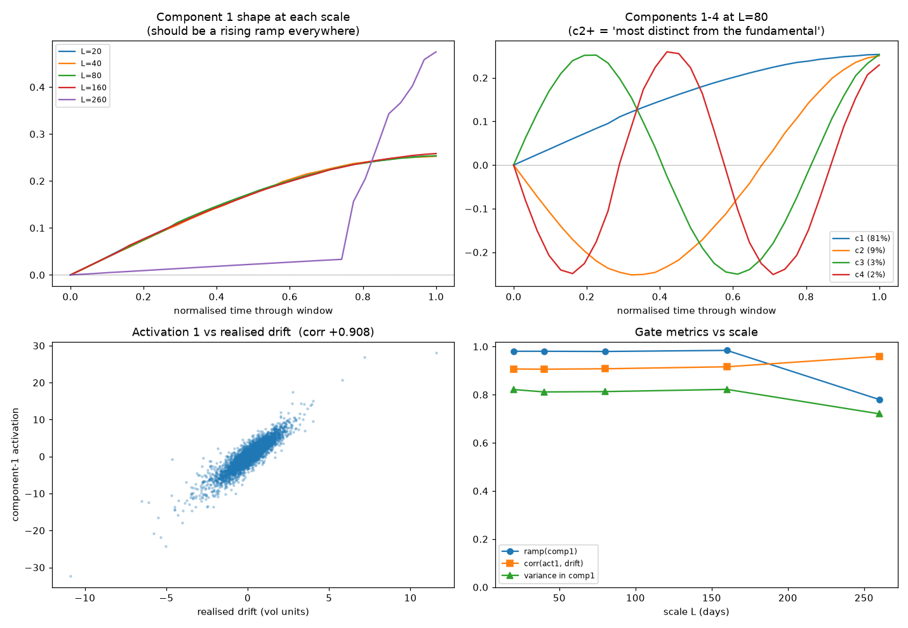

**Phase 1 — the Keogh null (`run_phase1_keogh.py`).** Real component shapes are
indistinguishable from iid-random-walk and return-shuffled surrogates:
subspace alignment **1.000** at L=20/80, per-component |cosine| ≥ 0.997; the
curves overlie exactly. The linear route's "patterns" are the Karhunen–Loève /
Fourier basis of a drifting diffusion — no market information in the *shapes*.
(At L=260 alignment falls to 0.51 — resolved in Phase 1b as instability, not
structure.) 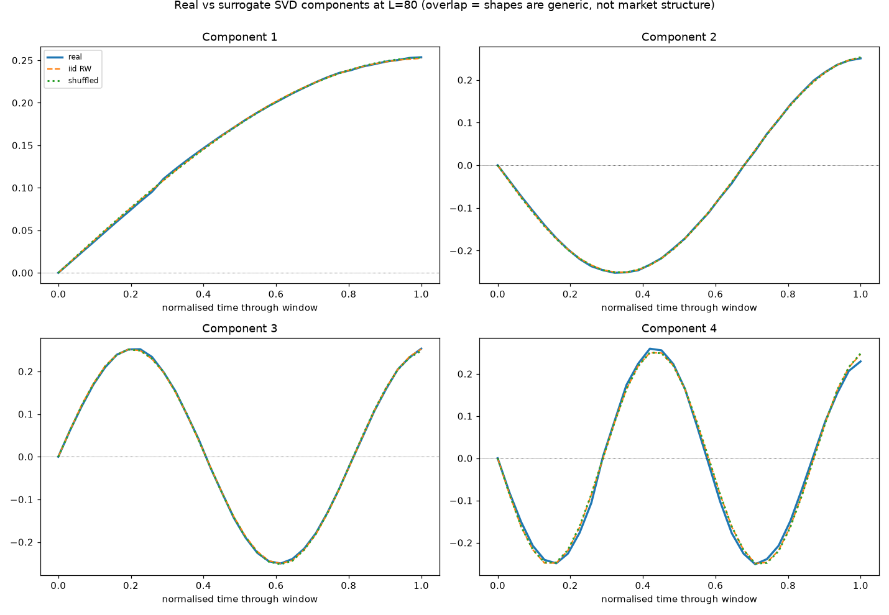

**Phase 1b — the L=260 anomaly resolved (`run_phase1b_longscale.py`).** Three
tests show the long-scale divergence is small-effective-sample instability, not
genuine structure. (A) The misalignment grows with component count (k=2: 0.75 →
k=6: 0.51), i.e. it lives in the noisy low-variance tail. (B) *Decisively*, the
real subspace does not agree with itself across two disjoint halves of the
universe at L=260 (real-vs-real **0.51**, vs 1.000 at L=80), while the surrogate
subspace is perfectly reproducible (surr-vs-surr 1.000) — the real long-scale
subspace is simply not well-determined. (C) Reducing window overlap (stride 5 →
60, fewer but more-independent 260-day windows) moves alignment **0.51 → 0.77 →
0.91**, back toward the diffusion basis. The estimator is shaky where the
effective sample is tiny (adjacent 260-day windows share 255/260 points), and
converges to generic diffusion as overlap is removed.

**Phase 2 / 2b — direction from the activations
(`run_phase2_direction.py`, `run_phase2b_scalecurve.py`).** Sweeping every
L in 20–260 (step 10): the only honest, pre-specified signal is short-scale
reversion — component-1 activation IC **−0.056 (L=20)**, ≈ −0.03 to −0.05 for
L≤60 (z to −3.2), fading to ~0 by L≥70. The fitted combination is consistently
worse than the best single component (fitted weights fit noise at low SNR — the
sibling's equal-weight-beats-fitted lesson). A best-of-components envelope
(~0.04–0.05) is post-hoc-selected and therefore optimistic. All reversion-signed;
nothing beyond depth/reversion. 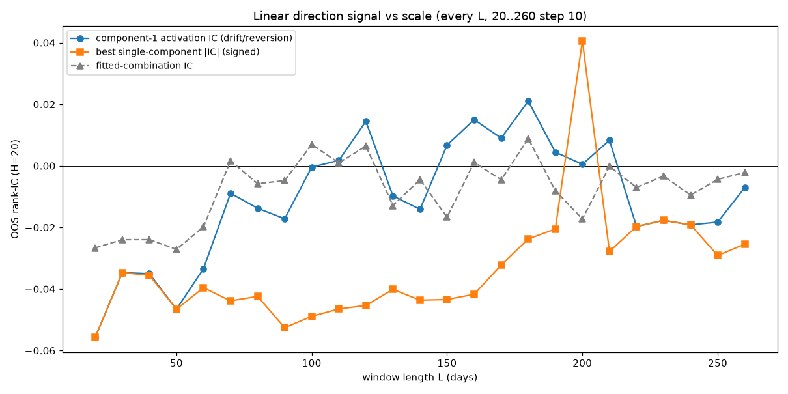

**Phase 3 — the non-linear growing autoencoder
(`run_phase3_nonlinear.py`).** Held to a bar fixed in advance. The autoencoder
trains (reconstructs 0.80→0.94 cumulative variance) but at every scale and
component count it reconstructs the residual **worse than PCA** (L=80:
0.803/0.885/0.915/0.931 vs 0.826/0.908/0.938/0.954). Its per-component and
combined direction ICs **track PCA's almost exactly** (L=40 combined −0.027 vs
−0.026). Verdict: **no exploitable non-linear structure**; non-linearity adds
zero predictive power. 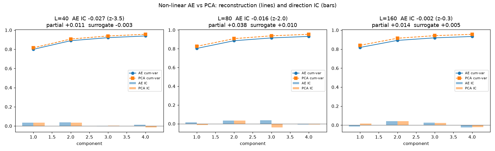

**Phase 3b — capacity robustness (`run_phase3b_capacity.py`).** To rule out
"the net was too small": joint autoencoders up to **h=64, two hidden layers each
side, a 5-unit tanh bottleneck, 150 epochs**, each vs PCA at equal code
dimension, out-of-sample. None reconstruct the held-out data better than PCA-d
(they tie at best; the deepest *underfits* to 0.869 vs 0.960 — extra depth hurts
where there is nothing curved to represent), and none lift direction IC past
0.05 or beyond PCA. **The negative is robust to capacity.**
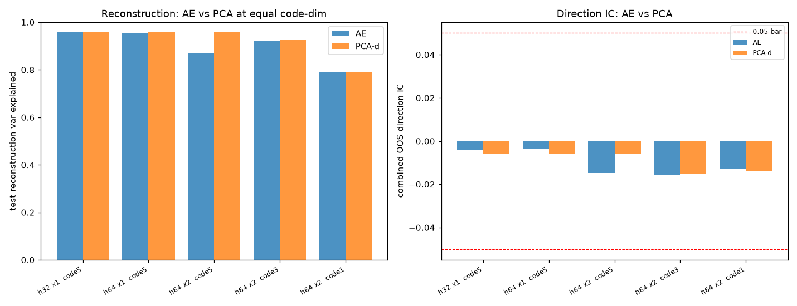

**Phase 3c — the exhaustive scale map (`run_phase3c_fullgrid.py`).** AE vs PCA at
*every* L in 20–260 (step 10), out-of-sample. Direction IC never reaches ±0.05 at
any scale (max |IC| 0.037 at L=20, the short-scale reversion), and the AE curve
lies on the PCA curve throughout. Reconstruction: AE ≤ PCA for L ≤ 190; at
L≈200–250 the AE reconstructs *better* (gap to +0.076 at L=220) — tripping
criterion (0) on its face. 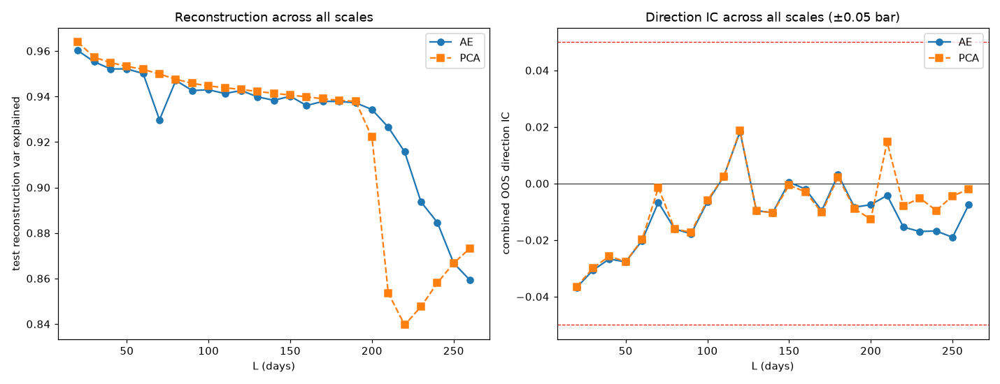

**Phase 3d — is the L≈220 bump structure? (`run_phase3d_longcheck.py`).** No — it
is the Phase-1b instability again. At L=220 with stride-5 overlap, PCA overfits
the unstable train subspace (train 0.947 vs test 0.840, a +0.108 gap) so the
regularised AE looks better (+0.076). Reducing overlap restores PCA: at stride
≥20 its test reconstruction recovers to ~0.93 and **the AE advantage vanishes
(−0.007 to −0.016)**. The long-scale reconstruction bump is a PCA-overfitting
symptom, not a non-linear pattern, and it produces no direction signal
(|IC| < 0.02 throughout L=200–250).

**Phase 4 — injection / recovery positive control (`run_phase4_injection.py`).**
The natural objection to any negative is "would the method even have caught a real
pattern?" We answer it by planting one — a biased-exponential-decay shape layered
on constant growth plus matched diffusion — and running the identical pipeline.
Three results: (i) component 1 stays the growth ramp at every injected amplitude
(0.98–0.99), so deflation's first stage is robust — the mechanism extracts growth
first even with a second pattern present; (ii) the planted pattern is captured as
residual variance along its direction, growing 1.0→1.8× as amplitude goes 0→2
(note: *not* as a novel shape — a detrended biased-exp-decay is itself nearly a
low-order sinusoid, so it is indistinguishable from the diffusion basis *by shape*;
it shows up as variance and as prediction); (iii) **direction IC scales steeply
with pattern strength** — 0.043 at A=0.5, **0.099 (z≈8) at A=1**, 0.255 at A=2 —
against a no-signal floor of **IC 0.001 ± 0.020** (A=0 over six datasets). So a
recurring pattern of ordinary size is caught at ~5σ; the pipeline is demonstrably
sensitive, at its native stride-5 coverage. A coherent pattern is self-predictive
even without explicit coupling (a window catching it mid-way forecasts its own
completion — precisely the TA claim), and explicit coupling lifts IC further
(A=1, ρ=0.8 → 0.138). 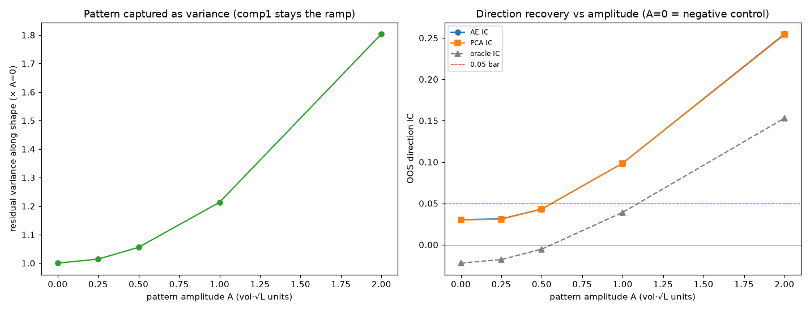

This calibrates the whole negative: real data's direction IC (~0, the short-scale
reversion aside) sits *at* the ±0.02 noise floor, far below the ~0.10 an ordinary
planted pattern produces — so a biased-exp-decay pattern of ordinary strength
would have been seen at many sigma. It is not there. The detection floor also
states the limit honestly: patterns weaker than IC ≈ 0.05 (amplitude below ~0.6
of a typical window's range) cannot be excluded — the residual uncertainty is a
matter of effect size and 26 years of data, not of method blindness.

## 4. Part II — the detection reframe (Phases 5–10)

Everything in Part I measured a **pooled average**: does shape predict return,
averaged over all windows. That is exactly the operation that punishes *rare* and
*heterogeneous* structure — a signal in a few percent of windows, or ten shapes
pointing different ways, averages to a whisper or cancels. Part II asks a
different question: not "does shape predict on average" but "is a real window
**distinguishable at all** from a fake that already contains growth and
volatility?" — a *detector*, direction-agnostic, which survives rarity because it
looks for an enriched sub-population rather than a signed mean.

**Phase 5 — the structure detector (`run_phase5_detector.py`).** Train a
gradient-boosted classifier, pooled and walk-forward, to tell real windows from
**vol-matched FHS surrogates** (same drift, same conditional-volatility envelope,
the standardised residuals shuffled so directional order is destroyed). Score it
by **tail enrichment** — the real fraction among the most-confident windows —
because rarity dilutes overall accuracy but concentrates in the confident tail.
Real is distinguishable: the top 1% score ~80% real, enrichment@5% +0.23, while a
surrogate-vs-surrogate control sits at chance (~0). A **spike-in rarity curve**
maps the floor: power for structure that is frequent (≳5–10% at ordinary
amplitude) or strong (down to ~1–2%). 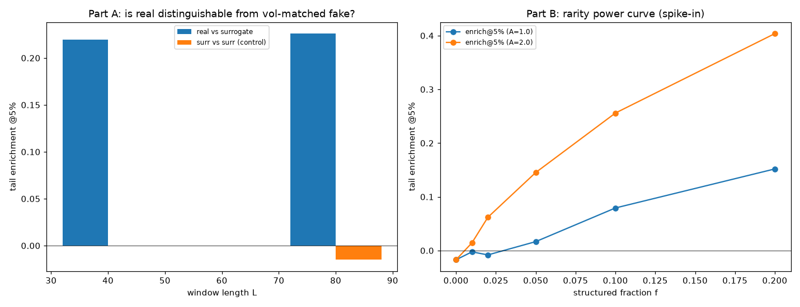

**Phase 5b — directional, not volatility (`run_phase5b_signflip.py`).** The FHS
null leaves a little residual vol clustering (|resid| autocorr ~0.10), so we
re-test against a **sign-flip surrogate**: every return magnitude kept in place —
volatility path, clustering, fat tails, trailing-vol scaling all byte-identical —
and only the signs randomised. Real is *still* distinguishable (enrich@5% +0.15,
control ~0). Since every second-moment quantity is unchanged, the difference can
only be **first-moment / directional** structure. 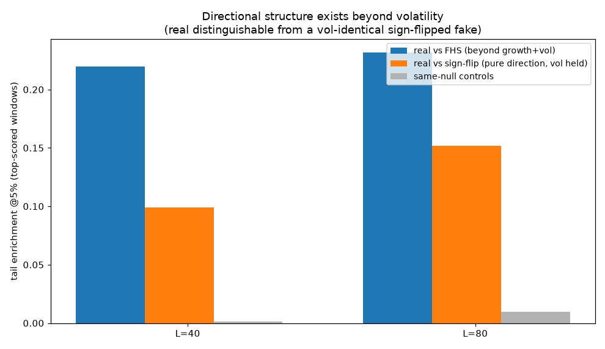

**Phase 6 — what the structure is (`run_phase6_classify.py`).** A handful of
interpretable features (drift, skew, lag-1 autocorrelation, early-vs-late
displacement, range) reproduce ~80% of the discrimination (full-shape AUC 0.565
vs known-features 0.548). The dominant driver is **reversion** (lag-1
autocorrelation), *not* skew. Clustering the confidently-structured windows gives
coherent types — rallies, declines (the biased-exp-decay *downward* among them), a
dip-and-recover — with a small residual beyond the known features.
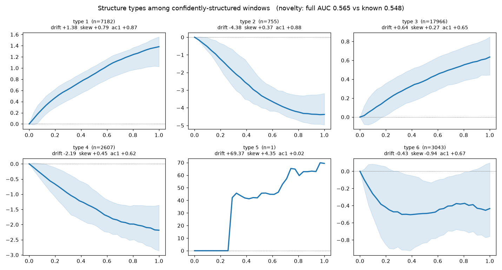

**Phase 7 — does it predict? (`run_phase7_predict.py`).** Conditioning on the
detector's structured windows **doubles the reversion IC** (0.033 pooled → 0.068)
— but a one-line "top-20% by |recent move|" amplitude filter matches it (0.073),
so the ML detector adds nothing over "pick the big moves". Per type, the only
significant forward moves are **down-moves that bounce** (reversal, t ≈ 3.5): the
biased-exp-decay does not *complete* its decay, it reverses; no type shows
continuation. A fitted structure-aware predictor overfits (OOS IC −0.023) — usable
only via simple conditioning, never a fitted combination. 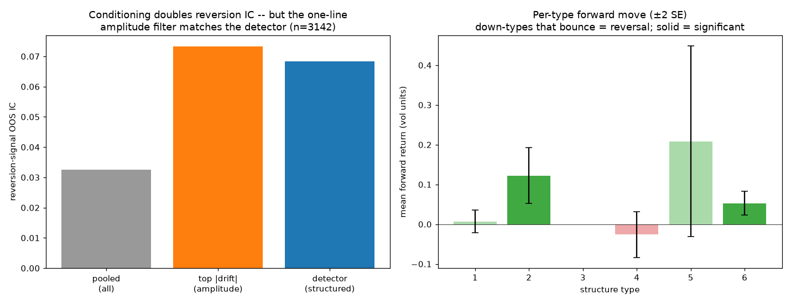

**Phase 8 — is it tradeable? (`run_phase8_backtest.py`).** No. The
reversion-after-large-moves signal, in both valid embodiments — cross-sectional
(long the biggest losers, short the biggest winners, monthly, inverse-vol sized)
and time-series (per-stock buy-the-dip) — **loses net of 10 bps costs**: net
Sharpe −0.30 / −0.29, market-hedged −0.31, max drawdown −75%, turnover 1.9, no
cost break-even (negative even at zero cost), negative in every sub-period. The
positive window-level IC does not convert: the signal is short-lived (high
turnover), crash-laden (falling knives), and cross-sectionally at an 80-day
formation the market is momentum-regime. IC is necessary, nowhere near sufficient
— the same gap the sibling projects flagged (their tradeable +0.36 needed
*combined* signals plus the full risk stack; reversion alone is this).
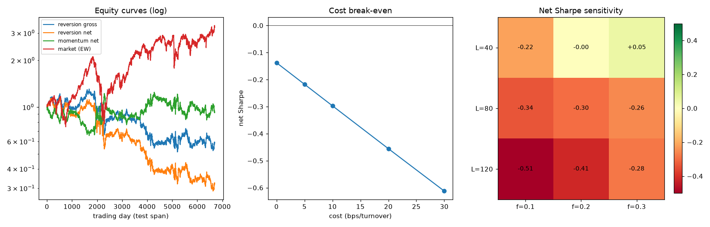

**Phase 9 — the novel residual, closed out (`run_phase9_residual.py`).** The
residual beyond known features is real on both counts. *Detection:* the full shape
beats known features by a stable **+0.016–0.018 AUC** across detector seeds.
*Prediction:* a shape component **orthogonal to drift/skew/reversion** carries an
OOS forward IC of **~0.033**, which survives a best-of-8 **multiple-testing null**
(null 0.015 ± 0.004, **p ≈ 0.000**) and is **positive in all four chronological
test sub-periods**. But the predictive shapes are **harmonic** — a late-window
hump and a higher-frequency wiggle — not a nameable pattern, and ~0.03 IC is the
same order as the reversion that just failed to trade, so it is **untradeable
alone**; its only plausible use is as an orthogonal diversifier in an equal-weight
combination, and even then marginal. 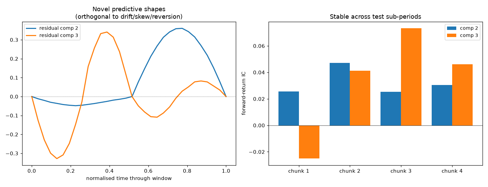

**Phase 10 — the blind human test (`run_phase10_human_test.py`).** The conviction
that opened the whole investigation was visual — *"I see structures in the chart
that don't look like random noise."* So we put the eye on the same footing as the
detector: a blind 2-alternative forced choice, 12 pairs, each a real 1-year
segment against a **vol-matched FHS surrogate of the same segment** (drift,
volatility envelope, clustering, fat tails all identical; only the directional
order scrambled), answer key sealed until committed. Score: **8/12 (67 %),
binomial p = 0.19** — above chance but not significant on 12 trials, and almost
exactly the ~57–59 % the classifier achieves. Two lessons: the eye and the machine
extract the *same faint edge*; and the structure is far subtler than intuition
insists — held volatility and trend fixed, the "obvious" pattern all but vanished,
confirming that most of what reads as structure in a price chart is volatility
texture and trend, not directional shape.

## 5. Conclusions

1. **The premise's precondition is genuinely met** — the fundamental growth
   pattern is discoverable, first and unprompted, at every scale. This is a real
   positive, and the reason the experiment was worth running.
2. **Everything most distinct from it is generic.** Linear residual shapes are
   the Fourier basis of a diffusion (Phase 1); there is no curved manifold
   beneath them (Phase 3), robustly to capacity (Phase 3b) and across every scale
   20–260 (Phase 3c). The only predictive content is the **short-scale reversion**
   already known, capped at |IC| ≈ 0.03–0.05 and un-improvable by fitted
   combination or non-linearity. The two apparent long-scale anomalies (Keogh
   alignment at L=260, reconstruction bump at L≈220) are one and the same
   small-effective-sample instability under heavy window overlap — they dissolve
   with independent windows and carry no predictive payoff (Phases 1b, 3d).
3. **This sharpens the programme's law.** *Sophistication pays only where SNR is
   high.* Reconstruction (high SNR) works and the AE nearly matches the optimal
   linear fit; direction (low SNR) gains nothing from the added machinery. The
   novel bit — a non-linear growing decomposition — found no structure the
   linear methods missed, because there is none to find.
4. **Part I is a seventh route to the same wall**, and a cleaner negative than the
   others: measured as a *pooled average*, recent-price-path shape — linear or
   non-linear, at any scale 20–260 — carries no predictive structure beyond a
   weak, short-horizon reversion. And the negative is **powered, not blind**
   (Phase 4): a planted pattern of ordinary size is caught at ~5σ; real data shows
   nothing of the kind. The honest caveat is effect size — patterns below IC ≈
   0.05 sit under the detection floor, a limit of 26 years of data, not of method.
5. **Part II shows the pooled-average framing was hiding the truth.** Ask instead
   whether a real window is *distinguishable* from a vol-matched fake, and the
   answer is yes: structure **exists**, is **detectable**, is genuinely
   **directional** (not volatility), and conditioning on it **concentrates** a
   signal. This is the first time in the whole programme a reframe beat the wall
   rather than hitting it — so the flat "chart patterns are a mirage" reading was
   too strong.
6. **But the structure collapses onto the known and the untradeable.** It is
   mostly amplitude-conditioned reversion, reachable by a one-line move-size filter
   (Phase 7); its predictive types are down-moves that *reverse*, not completing
   patterns; it loses money net of costs in every honest embodiment (Phase 8); and
   the one genuinely novel residual is real but ~0.03 IC and harmonic — a
   diversifier at best (Phase 9).
7. **The wall, located precisely.** It is *not* that price-shape structure doesn't
   exist, isn't detectable, or carries no forward information — all three proved
   false at the statistical level. It is that **every such signal, known or novel,
   is too small to survive costs alone.** The patterns are real, and
   reversion-shaped, and poor — a sharper and more honest end than "mirage", and
   fully consistent with the programme's law that value lives in volatility, not
   direction. Fittingly, the eye that started the investigation scores like the
   machine (Phase 10): a faint real edge, far weaker than intuition insists — the
   conviction was not wrong that *something* is there, only about how loud it is.

## Data-quality audit (`run_clean_audit.py`)

A late check found the equity universe held a corrupt index file (SPX, wrong
levels) and a handful of scrambled / unadjusted series (DCC, ITV, …) — ~14 of 122
by a spike-and-reversal ("bad print") test, up to ~38 if isolated split-like steps
are also excluded. Re-running the two at-risk positives on cleaned universes:
**reversion IC** falls from +0.033 (full) to +0.023–0.031 (clean) — about a third
of it was bad-print "bounces", but it survives; **detector enrichment@5%** is
essentially unchanged (+0.133 → +0.117 on the cleanest 84-series set). So the
negatives were never at risk (corruption cannot manufacture a null; the backtest
lost money regardless), the "directional structure exists" result is robust to the
corruption, and the only revision is that the already-tiny reversion is a touch
smaller still — which only reinforces "real but untradeable". `clean_universe()`
in `matching/universe.py` provides the audited universe for future work.

## Appendix — autoencoder specification

- **Phase 3 deflationary stack:** per component, 32 inputs → 16 tanh hidden → 1
  linear code → 16 tanh hidden → 32 linear output (~1,121 params); 4 components
  grown on residuals, each frozen before the next. Adam (lr 2e-3), 60 epochs,
  batch 2048, L2 1e-5.
- **Phase 3b capacity:** general MLP autoencoder, enc_hidden ∈ {[32],[64],
  [64,64]}, code_dim ∈ {1,3,5}, **every layer tanh except the linear output
  (bottleneck included)**; Adam, 150 epochs. Xavier init.

## 6. Reproducing

```
# Part I — the deflationary autoencoder
matching/represent.py       # strength-preserving windows (tested)
matching/autoencoder.py     # 1-D deflationary + general MLP autoencoder (grad-checked)
matching/universe.py        # 122-stock loader + iid/shuffle surrogates
matching/synth.py           # synthetic growth + biased-exp-decay generator (tested)
run_phase0_gate.py          # non-starter gate: is component 1 the drift ramp? (yes)
run_phase1_keogh.py         # are the linear shapes market-specific? (no)
run_phase1b_longscale.py    # resolves the L=260 anomaly (instability, not structure)
run_phase2_direction.py     # direction from activations (reversion, at ceiling)
run_phase2b_scalecurve.py   # direction IC across every L, 20..260
run_phase3_nonlinear.py     # non-linear growing AE vs the pre-registered bar (FAIL)
run_phase3b_capacity.py     # capacity robustness of the negative (robust)
run_phase3c_fullgrid.py     # AE vs PCA at every L, 20..260 (exhaustive map)
run_phase3d_longcheck.py    # the L~220 recon bump is instability, not structure
run_phase4_injection.py     # positive control: plant a pattern, map the detection floor

# Part II — the detection reframe
matching/surrogate.py       # FHS vol-matched + sign-flip surrogates (tested)
matching/xsec.py            # cross-sectional portfolio primitives (tested)
run_phase5_detector.py      # real vs vol-matched detector + rarity power curve (structure!)
run_phase5b_signflip.py     # is it directional or volatility? (directional)
run_phase6_classify.py      # what is the structure? (~80% known reversion)
run_phase7_predict.py       # does it predict? (yes, but = amplitude reversion)
run_phase8_backtest.py      # is it tradeable? (no: net Sharpe -0.30)
run_phase9_residual.py      # the small novel residual, closed out (real ~0.03, harmonic)
run_phase10_human_test.py   # blind human 2AFC vs vol-matched surrogates (8/12, ~machine level)
tests/                      # pytest: representation, autoencoder gradients, surrogates, xsec
```

Uses the shared venv at `../heirarchical-adaptive-filter-experiment` (numpy,
pandas, matplotlib, scikit-learn, pytest); `mc` is imported from
`../monte-carlo-experiment` via the venv `.pth`. No PyTorch — the autoencoders
are a small hand-written numpy implementation with Adam and checked gradients.
