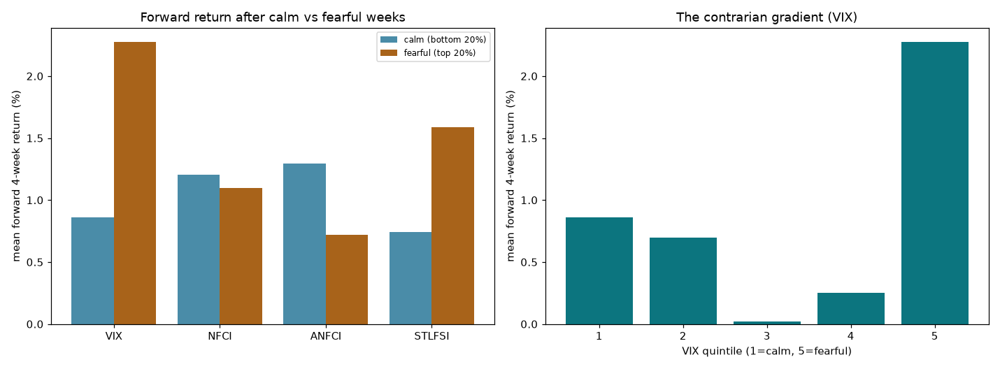

# Sentiment as a News Proxy — Findings (scoped)

*Does a "sentiment" indicator — retail up-vs-down positioning, à la BUX — proxy for
news, and is there a tradeable tail after the crowd reacts? The honest answer is
gated by data; what could be built tests only the aggregate-fear shadow of it.*

Sibling to the volatility programme; same discipline. Short, because the binding
constraint here is data, not method.

## TL;DR

- **The idea as posed is not testable for free.** Firm-level news, the **AAII**
  bull/bear survey, **CBOE put/call**, and **BUX-style retail positioning** are all
  unavailable (blocked pages / dead endpoints / paywalls). So "is retail
  positioning a news proxy with a tradeable tail?" stays genuinely open.
- **What is free are aggregate fear / stress gauges** — VIX plus FRED's NFCI,
  ANFCI and St-Louis financial-stress index — which test the honest core: does
  crowd fear predict forward equity returns contrarianly?
- **It does, but modestly and it's just VIX.** Fear is contrarian: **VIX rank-IC
  +0.147** with the forward 4-week Nasdaq return — the strongest single
  forward-return signal in the whole programme. The most fearful weeks return
  **+2.3%** next month vs **+0.9%** after calm weeks.
- **But it's a *tail* effect, not a gradient.** Only the top VIX quintile pays
  (+2.3%); quintiles 1–4 are flat-to-low. The edge is *buy capitulation* — crisis
  bottoms — so it is crash-prone (fear can rise further first).
- **The other gauges add nothing.** NFCI/ANFCI show no contrarian gradient and go
  *negative* after controlling for VIX. STLFSI just mirrors VIX. No incremental
  sentiment information beyond the fear gauge we already had.

## Data

Free from FRED: NASDAQCOM (equity, 1971+), VIXCLS (1990+), and the weekly
conditions/stress indices **NFCI**, **ANFCI** (1971+) and **STLFSI4** (1993+),
aligned to a weekly Friday grid (overlap 1993–2026, 1,703 weeks). Not obtainable:
AAII (HTML block), CBOE put/call (CDN 404s), any retail-positioning or news feed.

## Findings

**Phase 1 — contrarian fear (`run_phase1_contrarian.py`).** Per gauge, the causal
rank-IC with the forward 4-week return, forward return by quintile, and the
partial IC over VIX:

| gauge | IC | IC given VIX | calm-Q fwd | fearful-Q fwd |
|---|---|---|---|---|
| **VIX** | **+0.147** | — | +0.9% | **+2.3%** |
| STLFSI | +0.118 | −0.050 | +0.7% | +1.6% |
| NFCI | +0.058 | −0.079 | +1.2% | +1.1% |
| ANFCI | +0.061 | −0.054 | +1.3% | +0.7% |

The VIX contrarian gradient is monotone only in the tail: quintiles 1–5 return
+0.9 / +0.7 / +0.0 / +0.3 / **+2.3%**. 

## Conclusions

1. **It re-derives the programme's one genuine edge, from the sentiment side.**
   "Buy extreme fear for the rebound" is the equity-return face of the
   variance-premium finding — the return lives in the post-spike recovery. Same
   effect (IC ~0.15, tail-concentrated, hold-through-the-pain), reached through
   sentiment rather than the vol curve. Real, consistent — but not new.
2. **The free sentiment proxies collapse onto VIX.** No incremental information
   from financial-conditions indices; the "sentiment" signal is the fear gauge.
3. **The real question is data-locked, not answered.** Whether firm-level news or
   retail positioning carries a tradeable tail needs paid data (news sentiment,
   AAII, put/call, or a broker positioning feed) we do not have. That absence, not
   a null result, is the honest finding.

## Reproducing

```
sent/data.py                # weekly VIX + NFCI/ANFCI/STLFSI + Nasdaq panel
run_phase1_contrarian.py    # contrarian fear -> forward return (IC, quintiles, partial)
data/*.csv                  # cached FRED series
```

Shared venv at `../heirarchical-adaptive-filter-experiment`. Series pulled once
from FRED. To extend to the real test, supply an AAII / put-call / news-sentiment
or retail-positioning series and add it to `sent/data.py`.
