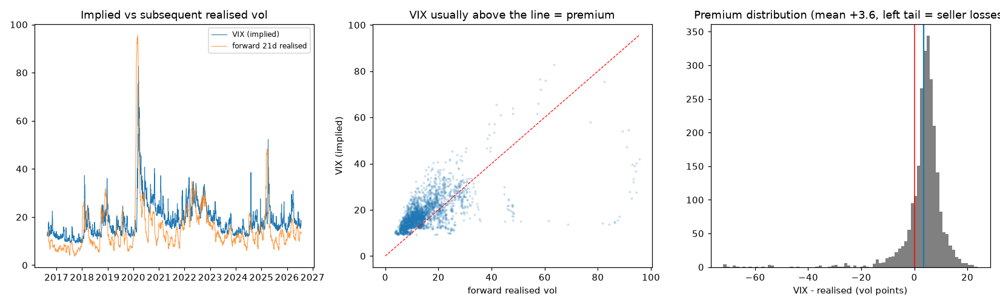
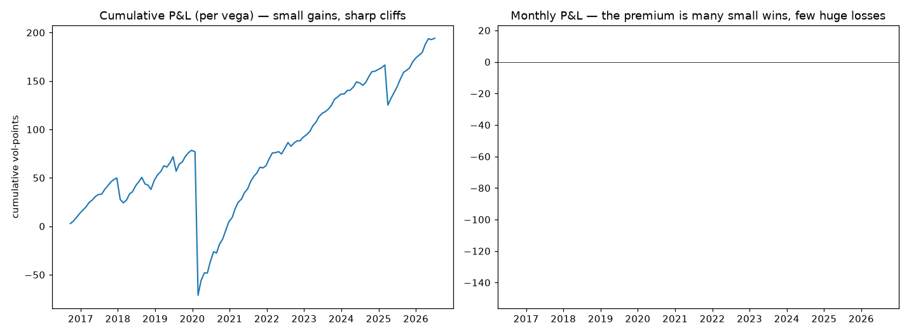
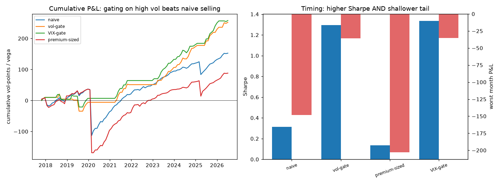
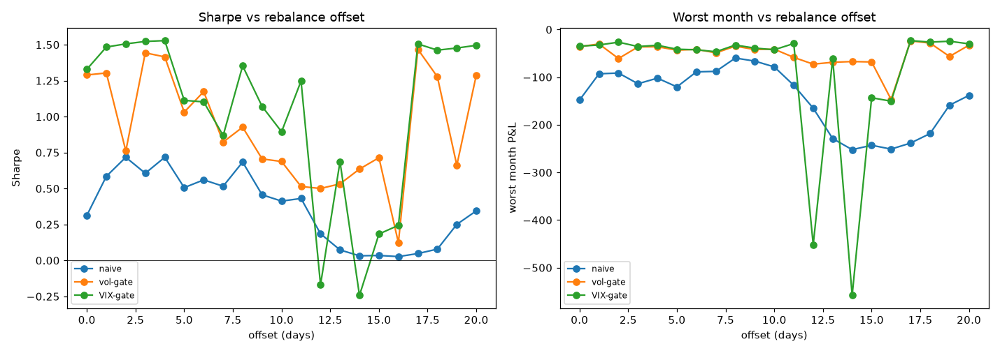
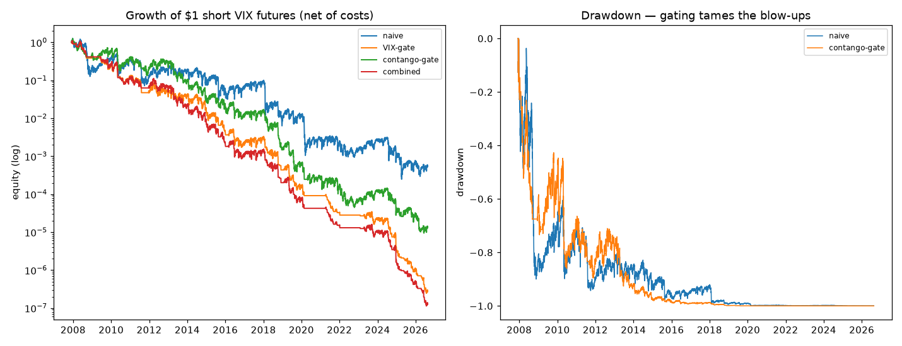

# The Variance Risk Premium — Findings

*The programme's one durable edge is forecasting volatility, not direction. Can
that skill be monetised? The natural vehicle is the **variance risk premium**:
implied volatility systematically exceeds realised, so selling variance earns a
premium — and a volatility forecast should tell you when to stop selling before a
spike. Tested on VIX + S&P 500.*

Sibling to the UK-equity programme (`../pattern-matching`, `../vol-risk-experiment`,
etc.); it reuses the `mc` returns/loader and the same discipline (causal /
walk-forward, net-of-tail honesty, robustness sweeps).

## TL;DR

- **The premium is real and robust.** VIX exceeds subsequent 21-day realised vol
  by **+3.6 vol points on average, 84% of the time**, positive in all five
  sub-periods; corr(VIX, realised) = 0.60. (Phase 1)
- **Harvested naively it is pennies before a steamroller.** A constant short-
  variance book earns Sharpe **+0.38** with 85% of months profitable — but one
  month (Feb→Mar 2020) at **−148** is a ~90-month drawdown in a single hit. (Phase 2)
- **On the proxy, regime-timing looked like a big win** — Sharpe **1.3**, worst
  month −148 → −35 (Phase 3). *This did not survive the real instrument (Phase 5,
  below) — it was a proxy artefact. Read Phase 3 as a cautionary tale, not a
  result.*
- **But the sophistication isn't needed, and premium-chasing backfires.** A plain
  **VIX-level gate** matches the HAR forecast; sizing *up* on the apparent premium
  (VIX − forecast) sells into the tail and makes it worse (−203). Simple beats
  complex, again. (Phase 3)
- **Robust to the rebalance grid.** Across all 21 monthly offsets the vol-gate
  beats naive **100% of the time** with a shallower tail every time — though the
  magnitude is sample-uncertain (Sharpe 0.1–1.5; typical ~0.9). (Phase 4)
- **The real tradeable instrument REVERSES the regime-timing headline** (Phase 5).
  Rebuilt on actual short-VIX-futures returns (carry − MTM from the term
  structure, 2007–2026, net of costs), the tradeable edge is a *modest* Sharpe
  **0.36** (vol-targeted: +4.4%/yr, maxDD −22%) — not the proxy's 1.3 — and regime
  gating now *hurts*. The reason is decisive: the entire short-vol return lives in
  the **10% of days when the curve is backwardated** (post-spike recovery, day-Sharpe
  +2.13); the 90% "calm carry" days earn ~0. Every gate that avoids high vol /
  backwardation throws away exactly the days that pay. The proxy's additive monthly
  accounting hid this — a textbook "good result was a proxy artefact".

## Data

Free and clean: **VIX** from FRED (VIXCLS, 1990–2026) and **S&P 500** from FRED
(SP500, 2016–2026), overlapping ~2016–2026 (2,492 days). *Note: the local
investing.com `SPX.csv` was found to be corrupt (wrong historical levels); FRED is
used instead.* Single-name equity options were not obtainable (no free history,
poor UK liquidity), and the variance premium is in any case an index phenomenon —
so VIX/S&P is the right instrument, not a compromise.

## Method & findings

**Phase 1 — establish the premium (`run_phase1_premium.py`).** Compare VIX at day
t with the S&P's realised vol over the next 21 days. Implied sits above realised
by +3.6 points, 84% of days, every sub-period; the left tail (seller losses) is
concentrated in Feb 2020, where VIX was low right before the crash.


**Phase 2 — naive harvest (`run_phase2_harvest.py`).** Short a 1-month variance
swap every month (constant vega), P&L per vega = (VIX² − RV²)/(2·VIX). Sharpe
+0.38, 85% of months green, but worst month −148 and maxDD −150 — the classic
convex short-vol payoff: many small wins, rare huge losses. 

**Phase 3 — regime-timing (`run_phase3_timing.py`).** Forecast forward realised
vol causally (HAR: trailing 1/5/22-day realised vol + VIX, expanding-window OLS;
skill corr 0.50) and size the book by it. Gating out high-vol months (`vol-gate`
Sharpe 1.29 / `VIX-gate` 1.33) ~4× the naive Sharpe and cuts the worst month to
−35, while invested only ~42% of the time. The plain VIX gate matches the forecast
(simple suffices); `premium-sized` (sell ∝ VIX − forecast) *backfires* (−203) by
sizing up exactly where the tail lurks. 

**Phase 4 — grid robustness (`run_phase4_robustness.py`).** Sweep all 21 monthly
rebalance offsets: the vol-gate beats naive at **100%** of offsets, worst-month
median −42 vs −120. The edge's *direction* is robust; its *magnitude* is
sample-uncertain (Sharpe 0.1–1.5), and the vol-gate (min 0.12) is marginally more
stable than the VIX-gate (min −0.24). 

**Phase 5 — the real tradeable test (`run_phase5_futures.py`).** Replace the
variance-swap proxy with the actual short-VIX-futures return — carry (contango
roll) minus mark-to-market — replicated from the VIX term structure (VIX + VIX3M,
2007–2026), net of a roll + switching cost. Two findings overturn Phase 3:
(i) properly sized (vol-targeted 15%), naive short-vol earns Sharpe **0.36**,
+4.4%/yr, maxDD −22% — modest and real, *far* below the proxy's 1.3; at full
notional it is a −100% wipeout (vol drag + tails), so sizing is everything.
(ii) **regime gating now *hurts*** (naive +0.36 → gates negative), the reverse of
Phase 3. The diagnostic is decisive: the whole return lives in the **10% of days
in backwardation** (post-spike recovery, day-Sharpe **+2.13**); the 90% contango
"carry" days earn ~0 (day-Sharpe +0.02). Every gate that avoids high vol /
backwardation discards exactly the paying days. Gating still cuts single blow-ups
(GFC 2008 −84% → −20%), so it has *survival* value, not risk-adjusted-return value.


## Conclusions

1. **The variance risk premium is real and modestly tradeable — Sharpe ~0.36,
   +4.4%/yr, −22% drawdown (vol-targeted short VIX futures, net of costs).** It
   sits where the thesis said value lives (the volatility axis), and it is the
   programme's one positive tradeable result — but *modest*, not the proxy's 1.3.
2. **The proxy oversold it, and regime-timing was a proxy artefact.** The
   additive, monthly variance-swap accounting flattered "step aside in high vol"
   to Sharpe 1.3; on the real, compounding instrument that gating *reverses* and
   hurts. Only building the tradeable instrument revealed it — "a good result is a
   bug until proven otherwise", demonstrated.
3. **The return comes from a counterintuitive place.** Not the contango carry (the
   90% calm days earn ~0) but the **post-spike mean-reversion** (the 10%
   backwardated days, day-Sharpe +2.13). You are paid for holding vol short
   *through* the stress, not for avoiding it — the opposite of the "harvest calm
   carry, dodge the spike" intuition, and the reason every sensible-looking gate
   backfires.
4. **Honest limits.** The term-structure replication is close to VXX/SPVXSTR but
   still a model (not live fills); the tail requires holding through gut-wrenching
   drawdowns (−22% vol-targeted, far worse un-sized) to earn the recovery, which is
   operationally and psychologically hard; and short-vol carries genuine
   blow-up-to-zero risk if oversized (as XIV showed in Feb 2018).

## Further work

- **Actual VIX-futures settlement prices** (CBOE) — the term-structure
  replication is close but a model; real front/second-contract prices and fills
  would firm the ~0.36 Sharpe.
- **Sizing / risk overlay** — since the return is the backwardation recovery, the
  useful control is *position sizing through* stress (vol-target, not gate-out),
  and disciplined survival of the −22%+ drawdowns; worth designing explicitly.
- **Other markets** — the same term-structure short-vol test on other index vols
  to see if the "return is in the recovery, not the carry" structure generalises.

## Reproducing

```
vrp/data.py                # FRED VIX / VIX3M / S&P 500 panels (SPX.csv corrupt; use FRED)
vrp/premium.py             # realised vol + variance-premium primitives (tested)
vrp/strategy.py            # variance-swap PROXY P&L + stats (tested)
vrp/forecast.py            # causal HAR forward-vol forecaster (tested)
vrp/futures.py             # REAL short-VIX-futures return (carry - MTM) + stats (tested)
run_phase1_premium.py      # the premium is real (+3.6 pts, 84%)
run_phase2_harvest.py      # naive proxy harvest (Sharpe 0.38, -148 tail)
run_phase3_timing.py       # proxy regime-timing (Sharpe 1.3) -- ARTEFACT, see phase 5
run_phase4_robustness.py   # proxy robustness across rebalance offsets
run_phase5_futures.py      # REAL instrument: Sharpe 0.36, gating HURTS, edge = recovery
tests/                     # pytest: premium, strategy, forecaster, futures
data/vix.csv, vix3m.csv, sp500_fred.csv   # cached FRED series
```

Shared venv at `../heirarchical-adaptive-filter-experiment`; `mc` via the venv
`.pth`. VIX/S&P pulled once from FRED (`fredgraph.csv?id=VIXCLS` / `id=SP500`).
